# ScopeArc

## AI駆動変更デリバリー・証跡基盤

### 要件定義・基本設計・技術アーキテクチャ

| 項目 | 内容 |
|---|---|
| 製品名 | **ScopeArc（スコープアーク）** |
| 対象 | 日本向け Java Web プロジェクト（Struts 1、Spring MVC、および将来の Framework 拡張） |
| 業務ドメイン | 電力システム（業務ルール、データ分類、承認規則は未確認） |
| 対象システム構成 | 現行システムと Migration 後システムの双方を対象候補とし、選択・対応関係は未固定 |
| 文書種別 | 要件定義／業務フロー／基本設計／技術アーキテクチャ |
| 文書版 | Draft v0.3（全項目未完了・未検証） |
| 調査基準日 | 2026-08-17 |
| 製品方針 | VS Code Plugin-first、Evidence-bound、複数プロジェクト再利用 |
| AI 利用形態 | GitHub Copilot ローカル対話を主経路とし、将来の Server AI API を併設 |
| 基準情報 | 将来の対象工程では Git または SVN の Source Revision と実コードを実装基準とし、設計書は業務根拠として差異を明示管理 |
| 実装・検証状態 | ScopeArc の実装、配置、DB適用、実行、受入はすべて未完了・未検証 |

`ScopeArc` は、人が承認した変更範囲（Scope）を中心に、顧客要求から影響分析、コード変更、UT、UI 自動テスト、成果物・証跡までの全工程（Arc）を一つの追跡可能な流れとして結び付けるという製品思想を表す。

---

## 0. 本文書の位置付け

### 0.1 目的

本システムは、顧客が入力した一文または複数文の「要望・問題・障害」を起点に、AI と決定論的な解析を組み合わせ、以下を一つの変更ケースとして最後まで追跡可能にする。

1. 影響分析
2. PG（Programming／実装）および UT（Unit Test）
3. UI 自動テスト
4. 成果物と証跡の生成

対象プロジェクトには、画面設計書、機能設計書、テーブル定義書、処理フロー、テスト仕様書など多種類の設計書が存在する。ただし、設計書同士および設計書とコードは完全には一致しない。そのため、AI に「正解らしい説明」を生成させることではなく、根拠、差異、未解決事項、承認範囲、実行結果を識別可能な状態で管理することを目的とする。

### 0.2 記述の区分

本文書は ScopeArc の新規設計 Draft であり、現行実装を根拠にしない。別製品・旧プロジェクトは、実装、設計、契約、成果物の根拠として扱わない。本文書内の機能、構成、契約、受入条件はすべて「未完了・未検証の目標設計」である。

| 区分 | 意味 |
|---|---|
| **目標設計** | 本要求を満たすために新たに採用する製品・業務・技術設計。状態は未完了 |
| **実装済み** | 本版では該当なし。実装と実行証跡が揃うまで未完了とする |
| **実行証跡** | 本版では未取得。実際の DB、プロセス、テスト、ブラウザ操作の結果が必要 |
| **未確認** | 実環境確認または利用者判断が必要な事項。未完了として管理 |

本版では ScopeArc の実装リポジトリ、実 DB、実環境、実ブラウザ、実案件コードを確認していない。したがって、すべての機能を「未完了・未検証」と扱う。

### 0.3 用語上の前提

- **PG：コード修正・機能実装（Programming）**を意味する。
- **UT：単体テスト（Unit Test）**を意味する。
- PostgreSQL は PG と略さず、常に `PostgreSQL` と記載する。
- 将来の対象工程ではコードを実装基準とする。ただし、対象工程の Repository、Revision、動作、潜在バグ、未実装は本版では未確認である。
- 設計書は破棄しない。コードと異なる場合も、顧客業務、期待仕様、過去経緯を示す証拠として保存する。
- 現行システムと Migration 後システムは混在させず、同一 Case でも対象 Variant（`current` / `migrated`）と Baseline を個別に固定する。双方に作業がある場合は、同一要求から Variant 別の Coding Task と Evidence を作成する。
- AI の回答は候補であり、スキーマ検証、根拠検証、承認を通過して初めて正式成果物になる。

### 0.4 本版の完了状態ルール

- 本文書の全 FR/NFR、Artifact、API、Agent、Skill、Hook、MCP、Worker、Store、Phase、Backlog、Acceptance は `未完了` とする。
- `合格`、`passed`、`verified`、`completed`、`Rebuild` などの表記は将来の受入条件または状態名であり、現在の実績を表さない。
- 実装、Install、Migration、DB 適用、Runtime、UT、UI、Evidence の実行証跡が提示されるまで、状態を `完了` に更新しない。
- Acceptance のチェックボックスはすべて未チェックのままとし、明示的な証跡と Reviewer 承認が揃った場合だけ個別に更新する。

---

# 1. エグゼクティブサマリー

## 1.1 結論

目標システムは、独立した Web 製品ではなく、**VS Code を主 UI とする Plugin-first 製品**とする。GitHub Copilot のカスタマイズ機能をすべて機械的に使うのではなく、役割ごとに必要なものを採用する。

| 能力 | 採用判断 | 主な責務 |
|---|---:|---|
| Custom Agents | 未完了（必須候補） | 影響分析、実装・UT、UI・証跡の役割分離。未作成・未検証 |
| Skills | 未完了（必須候補） | 業務固有手順、解析規則、テスト規則、成果物形式の再利用。未作成・未検証 |
| Instructions | 未完了（必須候補） | 全 Agent 共通の禁止事項、品質基準、言語、証跡方針。未作成・未検証 |
| Prompts | 未完了（推奨候補） | 定型開始操作を短縮。採否・内容とも未確定 |
| Hooks | 未完了（最小構成候補） | ツール実行前の範囲検査と実行後の証跡回収。利用可否未確認 |
| MCP Server | 未完了（必須候補） | VS Code/Copilot と決定論的 Core の境界契約。未実装・未接続 |
| Agent Plugin | 未完了（必須候補） | Agents、Skills、Hooks、MCP、Prompts の一括配布・版管理。未作成 |
| VS Code Extension（VSIX） | 未完了（必須候補） | Tree View、Diff、承認 UI、Git/SVN 連携、SecretStorage、実行状況表示。未作成 |
| Server AI API | 未完了（将来候補） | バッチ解析、大規模文書処理、将来の自動化。Provider と Policy 未確定 |

## 1.2 主要設計判断（すべて未完了）

以下は採用候補となる目標設計判断であり、実装済み、承認済み、運用開始済みを意味しない。

1. 製品 UI は VS Code に集約し、新規の業務 Web UI は構築しない。
2. Agent Plugin と VSIX を対にして同一バージョンでリリースする。
3. PostgreSQL を Canonical Data の唯一の正本とする。
4. Neo4j は関係探索用の派生 Projection とし、削除・再構築可能にする。
5. 顧客文から直接コード変更を開始せず、必ず `ImpactAssessmentDraft` を生成する。
6. 人が承認した `ApprovedChangeScope` を越える編集・コマンド実行を禁止する。
7. 設計書とコードの一致・不一致を二値化せず、差異状態と根拠を保存する。
8. 静的解析で解けない Struts、Session、Reflection、動的 SQL などは `unresolved` または `runtime_required` として残す。
9. UI 自動テストは Case と Test Data を中心に設計し、曖昧な locator を fail-closed で拒否する。
10. ローカル Copilot と Server AI は別製品にせず、同一の Context Package、Schema、Evidence 契約を利用する二つの実行チャネルとする。
11. AI は候補作成を担当し、範囲制御、Source ChangeSet 検証、テスト実行、証跡確定は Core が担当する。
12. 全成果物を Project、Snapshot、Source Revision、実行環境、Evidence Digest に結び付ける。

## 1.3 目標価値（現時点では未達）

- 変更依頼の根拠からコード、DB、テスト、証跡までを一つの Case で追跡できる。
- 設計書が古い、欠落している、相互矛盾している場合も、不確実性を隠さず作業を進められる。
- 複数プロジェクトで同じ製品を使い、プロジェクト固有差分のみ Profile／Skill／Adapter として差し替えられる。
- チームが同じ Agent、Skill、Hook、MCP を同じバージョンで導入できる。
- AI の説明だけではなく、Git/SVN の Source Diff、UT 結果、UI Trace、Screenshot、DB 検証を納品証拠として残せる。

---

# 2. 背景・課題・ゴール

## 2.1 現在の業務状況

対象は日本向けの Java Web システムである。初期対象となるレガシー案件に加え、今後は Spring MVC Web アプリケーションにも適用する。Core、Artifact Contract、Approval、Test、Evidence は Framework 非依存とし、解析方法だけを Framework Adapter として切り替える。

既存システムでは、長期間の改修により以下が混在している可能性が高い。

- Struts 1、Spring MVC、JSP、JavaScript、XML 設定、SQL、バッチ
- 既存 Excel Macro ツール：PG の一工程として必要な場合だけ、既存・外部・必要時生成の入力ファイルを指定し、Windows Excel 内のボタンを押して DTO、JSP、その他の Java/XML/設定コード、またはデータファイルを生成する外部実行フロー。Macro 内部は解析対象外。生成コードは必要な場合だけ承認済み範囲へ導入する
- 画面設計、機能設計、DB 設計、テスト仕様など形式の異なる設計書
- 設計書にはあるがコードに存在しない仕様
- コードにはあるが設計書に記述されていない実装
- 名称変更・画面統合・機能移行により一対一で対応できない対象
- Session、Reflection、動的遷移、動的 SQL により静的解析だけでは確定できない関係

顧客から届く情報は、詳細な変更仕様書とは限らず、次のような短い自然文である。

> 「検索画面で退会済み顧客も表示したい」

> 「登録ボタンを押すと特定のデータだけエラーになる。原因を調査して修正してほしい」

> 「請求一覧の金額表示を税込に変更し、既存帳票への影響も確認してほしい」

この自然文をそのまま AI に渡して実装させると、対象範囲、現行仕様、DB 影響、テスト範囲が推測に依存する。そのため、自然文を Change Case に構造化し、根拠を収集してから変更へ進む必要がある。

## 2.2 解決すべき問題

| ID | 問題 | 放置した場合のリスク |
|---|---|---|
| P-01 | 設計書とコードが一致しない | 誤った設計書を正として誤修正する |
| P-02 | 顧客文が曖昧 | AI が不足条件を補完し、意図外の変更を行う |
| P-03 | 影響範囲が人の経験に依存 | 呼出先、SQL、画面、帳票、テストを見落とす |
| P-04 | AI の編集範囲を制限できない | 関係のないファイルまで変更される |
| P-05 | UT と UI テストが分離 | 要求に対する End-to-End の証明ができない |
| P-06 | Screenshot だけが証跡 | 実行条件、Revision、対象データを再現できない |
| P-07 | プロジェクトごとに設定が属人化 | チーム・他案件へ再利用できない |
| P-08 | Copilot と将来の Server AI が別設計 | 成果物形式、品質、監査方法が分裂する |
| P-09 | Graph に全データを複製 | 正本が不明になり、更新不整合が発生する |
| P-10 | 未解決関係が「影響なし」に見える | 動的システム特有の見落としを隠す |

## 2.3 業務ゴール

| ID | ゴール | 成功条件 |
|---|---|---|
| G-01 | 顧客文を追跡可能な Change Case にする | 原文、解釈、前提、確認事項が保存される |
| G-02 | 根拠付き影響分析を行う | 各影響項目に Code Anchor または Evidence がある |
| G-03 | 人が変更範囲を統制する | 承認前にコード変更不可、承認外差分は失敗扱い |
| G-04 | PG/UT を再現可能にする | Revision、コマンド、出力、環境が記録される |
| G-05 | UI 動作を業務 Case と結び付ける | Test Data、画面、操作、期待値、Trace が対応する |
| G-06 | 成果物を自動構成する | Manifest から全証跡を検証・再取得できる |
| G-07 | 複数案件に再利用する | Core を共通化し、Profile と Adapter で差異を吸収する |
| G-08 | AI チャネルを交換可能にする | Local Copilot と Server AI が同じ契約を満たす |

## 2.4 対象外

- 顧客向けの新規独立 Web ポータルの構築
- 承認なしの本番環境変更・本番データ更新
- AI による自動要件確定
- すべての動的関係を静的解析だけで完全確定すること
- Excel Macro/VBA の静的解析、Call Graph 化、自動改修、Web/Java への置換
- Neo4j をコード、設計書、証跡ファイルの正本にすること
- Screenshot の見た目だけでテスト合否を確定すること
- 初期段階から全プロジェクト固有フレームワークを一度に対応すること

---

# 3. 現行実装・証跡の状態

## 3.1 調査対象

本版では ScopeArc の実装リポジトリ、顧客 Java Web リポジトリ、実案件の設計書、Macro Workbook、実 DB、実行環境を受領していない。したがって、現行実装を確認したという事実は存在しない。

旧製品、別プロジェクト、既存コード、既存 MCP、既存 Graph、既存 Schema は ScopeArc の根拠・再利用資産・完成証跡として扱わない。

**状態：未完了・未確認**

## 3.2 現行能力

現時点で ScopeArc に関して「実装済み」「稼働中」「利用可能」と判定できる機能はない。

| 領域 | 状態 | 必要な確認 |
|---|---|---|
| VS Code Extension（VSIX） | 未実装・未検証 | 新規 Repository、Build、Install、Command、UI 実行証跡 |
| Agent Plugin | 未作成・未検証 | Manifest、Install、Version、Team Policy |
| Custom Agents / Skills / Instructions / Prompts | 未作成・未検証 | 各資産の内容、Schema、完了条件、実行確認 |
| Hooks | 未作成・未検証 | Client/Organization Policy、Pre/Post/Session End の実行証跡 |
| MCP Server | 未実装・未接続 | Tool Schema、Authorization、Core 接続、Bypass Test |
| PostgreSQL Canonical | 未構築・未検証 | Migration、Schema、Transaction、Backup/Restore |
| Neo4j Projection | 未構築・未検証 | Projection、Rebuild、Lag、Degraded Mode |
| CodeGraph | 未実装・未検証 | 実案件 Java/JSP/XML/SQL、Git/SVN、Resolution Evidence |
| Document Canonicalization | 未実装・未検証 | 実際の設計書形式、抽出、Profile 承認 |
| Excel Macro 外部実行 | 未実装・未検証 | Workbook、Host、Input、Button、Output、Policy |
| Generated Code Import | 未実装・未検証 | Import Plan、Approval、Staging、Diff、Rollback |
| PG / UT | 未実装・未検証 | Build、Command、Test Data、Result、Coverage |
| UI Automation | 未実装・未検証 | Environment、Login、Data、Locator、Trace |
| Server AI API | 未接続・未検証 | Provider、Data Policy、Gateway、Cost、Audit |
| Evidence / Delivery | 未実装・未検証 | Artifact Store、Manifest、Digest、Report、Review |

## 3.3 現行 MCP ツール

ScopeArc に対して現行利用可能な MCP Tool は、**未確認であり、存在しないものとして設計する**。実装開始後に Tool Contract、権限、入力/出力 Schema、Idempotency、Audit を新規定義する。

**状態：未完了・未確認**

## 3.4 現状と目標の差分

本版では「現状実装」を基準にした差分表を作れない。以下はすべて新規構築対象である。

| 領域 | 現状状態 | 目標 | 判定 |
|---|---|---|---|
| 製品 UI | 未実装 | VS Code Plugin-first | 未完了 |
| Agent Plugin / VSIX | 未実装 | 同一 Release で配布 | 未完了 |
| Copilot カスタマイズ | 未実装 | Agents、Skills、Instructions、Hooks、Prompts、MCP | 未完了 |
| Code Graph | 未実装 | PostgreSQL Canonical + Neo4j Projection | 未完了 |
| AI | 未接続 | Local Copilot + 将来の Provider-neutral Server AI | 未完了 |
| Scope 管理 | 未実装 | Draft と Approved Scope の分離 | 未完了 |
| Evidence | 未実装 | Revision・Data・Command・Trace を束ねる Manifest | 未完了 |
| 複数案件 | 未実装 | Project Profile / Adapter による再利用 | 未完了 |

## 3.5 未完了・未確認事項

以下はすべて未完了であり、実案件 PoC、実行証跡、利用者承認によって初めて状態を更新する。

- Pilot Project、現行／Migration 後の対象 Variant、Repository、Branch/Path、代表 Source Revision
- Variant ごとの Git/SVN 選択、Credential、Review/Commit 規則、および現行→Migration 後の対応関係
- Java/JDK、Application Server、Framework、Build Tool、CI Command
- 設計書の実ファイル形式、容量、命名、更新頻度、抽出可否
- 設計書とコードの不一致例、期待する差異状態、業務上の優先順位
- Windows Excel Macro Workbook、Excel/Windows Version、実行 Host、COM/Desktop Automation、Trust Policy、Input、Button、Output
- Macro が生成するデータとコードの分類、工程への導入対象、Target Path、上書き/マージ規則
- DTO/JSP/その他の生成コードの拡張子、生成元 Input、候補 Target Path、導入承認者、Target Hash 衝突時の扱い、Rollback、VCS 反映規則
- 電力システム固有の業務用語、データ分類、業務休日・時間帯、権限、承認・監査要件
- Test/Staging 環境、Login、Test Data、既存 Input File、Cleanup、許可される副作用
- GitHub Copilot、Agent Plugin、Hooks、MCP の組織 Policy と Version
- Neo4j、PostgreSQL、Artifact Store の配置、Backup、Retention、アクセス制御
- Server AI Provider、Data Residency、外部送信可否、Cost 上限
- 顧客向け Template、Evidence 必須項目、承認者、Waiver 規則

---

# 4. 要件定義（全要件未完了・未検証）

## 4.1 利用者と責務

| Actor | 主な責務 | 許可される判断 |
|---|---|---|
| Requester／顧客窓口 | 要望・問題・障害の提示、業務期待の確認 | 要求原文、受入期待の確認 |
| Analyst／SE | 要求解釈、影響範囲レビュー | Impact Draft の修正、Scope 承認依頼 |
| Approver／責任者 | リスク・範囲・実行の承認 | `ApprovedChangeScope`、テスト実行、本番相当操作 |
| Developer | PG、UT、技術判断 | 承認範囲内の実装、追加確認の起票 |
| Tester | UI Case、Test Data、結果判定 | テストシナリオと期待値の承認 |
| Auditor／Reviewer | 証跡、Revision、範囲、再現性の確認 | 成果物受入または差戻し |
| Local Copilot | VS Code 内での対話的 AI 支援 | 候補作成。正式承認は不可 |
| Server AI Worker | バッチ解析、候補作成、将来の自動化 | Policy で許可された Job のみ |
| Deterministic Core | 状態、契約、Policy、実行、Evidence 管理 | Gate の機械判定。業務判断は代替しない |

## 4.2 機能要件

### 4.2.1 Intake と Change Case

| ID | 要件 | 受入条件 |
|---|---|---|
| FR-001 | 顧客の一文・複数文を原文のまま保存する | 改変前原文、入力者、日時、Channel が保存される |
| FR-002 | AI が要求種別、対象、期待、症状、制約を構造化する | 構造化結果と原文の対応が表示される |
| FR-003 | 不明点を質問候補として生成する | 推測で埋めず `open_questions` に残る |
| FR-004 | 類似する既存 Case を検索する | Snapshot と検索根拠が記録される |
| FR-005 | Case に一意 ID と状態を付与する | 全 Artifact が同じ `change_case_id` を参照する |

### 4.2.2 Baseline と設計書管理

| ID | 要件 | 受入条件 |
|---|---|---|
| FR-010 | Git または SVN の Source Revision を固定して解析する | VCS 種別と検証済み Revision Identity がない解析結果は正式化できない |
| FR-011 | 設計書の原本、抽出内容、構造、版を保存する | Hash、File、Sheet/Page、抽出器 Version がある |
| FR-012 | 設計書間・設計書とコードの差異を分類する | `aligned/partial/code_only/design_only/conflict/migrated/unresolved` を保持 |
| FR-013 | Project ごとに文書形式 Profile を学習・承認する | Draft と Approved Profile が分離される |
| FR-014 | コードを意味的に参照できる Anchor を生成する | File、Symbol、Range、Revision、Digest を持つ |
| FR-015 | ソース本文は全体を保持する | RAG 用 Chunk が正本にならない |
| FR-016 | Project Profile で Git/SVN Version Control Adapter を選択する | Core の Workflow と Artifact Schema を VCS ごとに分岐させない |
| FR-017 | Source Workspace の VCS 固有状態を検証する | Git Dirty/Untracked/Submodule と SVN Mixed Revision/Switched/Property/Externals を記録する |
| FR-018 | Repository への確定操作を別途承認する | Git Commit/Push と SVN Commit は PG/UT 完了だけでは実行されず、`SourceCommitAuthorization` を要求する |
| FR-019 | 現行システムと Migration 後システムを別 Variant として管理する | `current` / `migrated` ごとに Project Profile、VCS、Revision、Scope、Evidence を固定し、両方に作業がある場合も混在させない |

### 4.2.3 影響分析

| ID | 要件 | 受入条件 |
|---|---|---|
| FR-020 | 文書、コード、Graph、Runtime Evidence を統合検索する | Retrieval Trace と除外理由を確認できる |
| FR-021 | 影響候補を画面、Action、Service、SQL、Table、Test 単位で出す | 各項目に Evidence Ref または Unknown 理由がある |
| FR-022 | Graph Path を表示する | Requirement から対象までの経路と Snapshot が見える |
| FR-023 | 静的に確定できない関係を未解決で残す | `unresolved/runtime_required/coverage_gap` を保持 |
| FR-024 | AI が `ImpactAssessmentDraft` を生成する | Draft は自動で Approved にならない |
| FR-025 | 人が対象・除外・条件を編集して承認する | Approver、時刻、Revision、Scope Digest が保存される |
| FR-026 | 追加発見時に再承認を要求する | Scope 外変更を自動追加しない |

### 4.2.4 PG／UT

| ID | 要件 | 受入条件 |
|---|---|---|
| FR-030 | Approved Scope から Coding Task を生成する | Allowed Files/Symbols/Commands が明示される |
| FR-031 | VCS に応じた分離 Workspace で編集する | Git は Branch/Worktree、SVN は独立 Working Copy を使用し、Base と Working State を追跡する |
| FR-032 | ローカル Copilot が bounded context を取得する | 不要なリポジトリ全体を Prompt に含めない |
| FR-033 | 実装差分を Scope と照合する | Scope 外差分がある場合は Gate 失敗 |
| FR-034 | UT を選定・生成・実行する | 選定根拠、Command、Exit Code、Log が保存される |
| FR-035 | Failure を分類して Case に戻す | product/test/data/environment の分類がある |
| FR-036 | 既存テスト未実行を成功とみなさない | `not_run/blocked/partial/passed/failed` を区別する |

### 4.2.5 UI 自動テスト

| ID | 要件 | 受入条件 |
|---|---|---|
| FR-040 | 要求から業務 Test Case を生成する | 前提、Data、Steps、Expected Result がある |
| FR-041 | Test Data または既存 Input File を Case と Environment に結び付ける | Source Type（existing/external/generated）、Record/File Scope、Hash、Cleanup 方針がある |
| FR-042 | Screen Identity を検証してから操作する | 別画面での誤操作を拒否する |
| FR-043 | 対象 Record を一意に絞る | 一意性が確認できない場合は操作を停止する |
| FR-044 | Locator を fail-closed で検証する | `.first`、行番号、曖昧 Text、未検証 CSS を禁止する |
| FR-045 | Playwright Trace、Screenshot、Video、Console、Network を収集する | Artifact が Execution ID に結び付く |
| FR-046 | UI Failure から影響分析へ戻せる | 新しい Anchor/Evidence として再解析できる |

### 4.2.6 PG 中の Excel Macro・生成コード導入

Macro は UI 自動テストではなく、PG（コード修正・機能実装）の途中で必要な場合だけ実行する外部工程である。

| ID | 要件 | 受入条件 |
|---|---|---|
| FR-047 | 既存 Excel Macro Execution を外部実行依存として保持する | Macro/VBA を解析・Web 化・書き換えせず、実行時に必要な Workbook、入力、ボタン、生成ファイルを指定できる |
| FR-048 | Windows Excel を実行環境付きで再現する | Workbook Hash、Excel Version、Windows Version、Trust Policy、入力 File Hash、Input Source Type が記録される |
| FR-049 | Excel 生成ファイルを正式 Evidence にする | Output File Hash、生成時刻、Output Type（`dto/jsp/java/xml/sql/config/data/other`）、Case、System Variant、Source Revision、Macro Execution ID が結び付く |
| FR-050 | Macro 実行の副作用を制御する | 外部 File/Network/Shell/Workbook Write は Policy と Authorization を通過する |
| FR-050a | DTO/JSP/その他の生成コードを必要な場合だけ工程へ導入する | `GeneratedCodeImportPlan`、対象 Path、Scope、Source/Target Hash、差分、導入理由、別承認者の承認、Rollback 情報が揃わない導入は拒否する |

生成コードの工程導入承認は `ApprovedChangeScope` の承認、`SourceCommitAuthorization` の承認とは別の承認として管理する。正式ファイルとして取り込んだ後は `SourceChangeSet` に含め、通常の Diff Gate、UT、VCS Commit 許可を通過させる。

### 4.2.7 成果物・証跡

| ID | 要件 | 受入条件 |
|---|---|---|
| FR-051 | Case 単位で成果物 Manifest を生成する | 必須 Artifact と Hash を一覧化する |
| FR-052 | 影響分析書を日本語で出力する | Scope、根拠、Unknown、承認が含まれる |
| FR-053 | 変更仕様・差分一覧を出力する | File/Symbol、目的、Diff、Revision が対応する |
| FR-054 | PG（Macro を含む）/UT/UI 結果報告を出力する | 実行環境、対象、結果、失敗詳細が含まれる |
| FR-055 | Evidence の改ざん検知を行う | Artifact Hash と Manifest Digest を検証できる |
| FR-056 | 未実施・未確認項目を明示する | 空欄や暗黙成功でなく Coverage State を表示する |

### 4.2.8 配布・複数プロジェクト

| ID | 要件 | 受入条件 |
|---|---|---|
| FR-060 | Agent Plugin にカスタマイズ資産をまとめる | Agents、Skills、Hooks、MCP、Prompts を一括導入できる |
| FR-061 | VSIX と Agent Plugin を同一 Release で配布する | Compatibility Matrix と同一 SemVer がある |
| FR-062 | Project Profile で案件差異を吸収する | Core の Fork を原則不要にする |
| FR-063 | チームで許可 Version を統制する | Manifest、署名、Checksum を確認できる |
| FR-064 | Rollback を可能にする | 一つ前の互換 Version に戻せる |

### 4.2.9 Server AI

| ID | 要件 | 受入条件 |
|---|---|---|
| FR-070 | AI Provider を Gateway で抽象化する | Provider 固有形式が Domain Contract に漏れない |
| FR-071 | Local Copilot と同じ Job/Artifact 契約を使う | Channel を変えても成果物 Schema が同じ |
| FR-072 | Project Policy で外部送信を制御する | deny/sanitized/approved の判定が記録される |
| FR-073 | バッチ Job を再試行・中断・再開する | Idempotency Key と Checkpoint がある |
| FR-074 | AI 利用量と Model 情報を監査する | Provider、Model、Policy、Token/Cost が追跡される |

## 4.3 非機能要件

| ID | 分類 | 要件 |
|---|---|---|
| NFR-001 | 追跡性 | 全 Artifact は Project、Case、Snapshot、Revision、Execution に結び付く |
| NFR-002 | 再現性 | 同じ Revision、Profile、Parser Version、Command を再実行できる |
| NFR-003 | 安全性 | 承認前および承認範囲外の書込みを拒否する |
| NFR-004 | 明示的不確実性 | Unknown、Unresolved、Coverage Gap を第一級状態として扱う |
| NFR-005 | 可用性 | AI Provider 停止時も Canonical Data と既存 Evidence を閲覧できる |
| NFR-006 | Degraded Mode | Neo4j や Search Index が停止しても状態を明示して限定処理できる |
| NFR-007 | 性能 | Interactive 操作は小さい Context Package を優先し、重い解析は非同期化する |
| NFR-008 | 拡張性 | Parser、Framework Adapter、Version Control Adapter、Document Extractor、AI Provider を Plug-in 化する |
| NFR-009 | 互換性 | Artifact Schema は Version を持ち、破壊的変更を検知する |
| NFR-010 | セキュリティ | Secret を Prompt、Log、Artifact に平文出力しない |
| NFR-011 | 監査 | 承認、実行、失敗、再実行、Override を Append-only に記録する |
| NFR-012 | データ保護 | 外部 AI 送信前に分類、最小化、Masking を実行する |
| NFR-013 | 保守性 | Domain Core は VS Code API、Provider SDK、Neo4j Driver に直接依存しない |
| NFR-014 | テスト容易性 | Contract Test、Projection Test、E2E Test を分離する |
| NFR-015 | 日本語品質 | 顧客向け成果物は日本語、識別子は英語で安定化する |
| NFR-016 | 配布 | Plugin/VSIX/Server/Schema の Compatibility を自動検証する |
| NFR-017 | 完全性 | Evidence 必須項目が不足する Case は Completed に遷移できない |
| NFR-018 | Recovery | Canonical PostgreSQL から Neo4j と Search Index を再構築できる |
| NFR-019 | Legacy Preservation | Excel Macro/VBA の内部解析・自動改修は初期対象外とし、既存 Workbook は Version・Hash 付きで保持する。PG で必要な外部実行は別契約で管理する |
| NFR-020 | Macro Reproducibility | 同じ Windows Excel/Windows Version/Policy/Input File/Workbook Revision で生成結果を再検証できる |
| NFR-021 | Generated Code Import Safety | 生成コードは作業用 Staging と Scope/Diff Gate を経由し、承認なしの工程ファイル上書きや Scope 外導入を許可しない |

---

# 5. End-to-End 業務フロー（未実装・未検証）

## 5.1 全体フロー

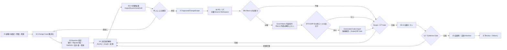

## 5.2 各段階の詳細

### Step 01：顧客入力

入力は短文でもよい。システムは原文を変更せず保存し、受付 Channel、入力者、時刻、関連 Ticket、添付ファイルを記録する。

出力：`RequestStatement`

### Step 02：Change Case 構造化

AI は次を候補化する。

- request type：enhancement / defect / incident / inquiry / obstacle
- business object
- observed behavior
- expected behavior
- affected user or role
- timing and precondition
- acceptance hint
- open questions

決定論的 Core は Schema を検証し、AI が原文にない事実を断定していないかを確認する。曖昧な内容は `assumption` または `open_question` に残す。

出力：`ChangeCaseDraft`

### Step 03：Baseline 固定

解析対象を変動させないため、次を Snapshot として固定する。

- Project ID、VCS Type、Repository Identity、Source Path、Source Revision Ref
- System Variant（`current` / `migrated`）、System Lineage、対応付け・比較対象の有無
- Git の場合：Remote/Repository、Branch/Tag、Commit SHA
- SVN の場合：Repository UUID、Repository-relative Path、Revision Number、Peg Revision、Externals Snapshot
- 設計書 Manifest と各 File Hash
- Document Profile Version
- Parser／Adapter Version
- DB Schema Snapshot または Migration Revision
- 対象環境と設定 Profile

出力：`AnalysisBaseline`

### Step 04：決定論的解析

AI の前に機械的に次を実行する。

1. 設計書から識別子、画面名、項目名、テーブル名、SQL、業務語彙を抽出する。
2. ソースを Tree-sitter および Framework Adapter で解析する。
3. File、Class、Method、Route、Action、JSP、Form、SQL、Table、Test の Anchor を作る。
4. 設計書 Fact と Code Anchor の候補対応を Scoring する。
5. 確定できない候補を suppression せず、理由付きで残す。
6. PostgreSQL に Canonical Fact を保存し、Neo4j Projection を更新する。

出力：`DocumentFacts`、`CodeGraphSnapshot`、`CodeAnchorMatch`、`RuntimeRequirement`

### Step 05：AI 影響候補

Core が Context Package を作り、Local Copilot または Server AI に渡す。AI は自由検索せず、Package 内の根拠を使用して影響候補、変更案、テスト観点、不明点を作る。

出力：`ImpactAssessmentDraft`

### Step 06：人による確認

VS Code 上で以下を確認する。

- 顧客原文と AI 解釈
- 根拠となる設計書領域、Code Anchor、Graph Path
- 変更対象と明示的除外対象
- `unresolved`、`runtime_required`、`coverage_gap`
- 変更リスクと必要なテスト

不足があれば追加調査へ戻し、範囲が確定した場合のみ承認する。

### Step 07：Approved Change Scope

承認結果には最低限次を含める。

- allowed files / symbols / DB objects
- forbidden areas
- allowed commands
- required UT / UI cases
- data restrictions
- approval identity / timestamp
- baseline revision / scope digest
- expiration and invalidation conditions

Source Revision、設計書 Snapshot、Scope 対象が変わった場合は承認を無効化する。

### Step 08：PG・UT

Core は VCS Adapter を通じて分離 Source Workspace を準備する。Git では Branch／Worktree、SVN では固定 Revision から Checkout した独立 Working Copy を使用する。Copilot は VS Code 内で利用者と対話しながら実装する。Server AI を利用する場合も、許可された隔離 Workspace と同一 Tool Contract に限定する。

実装後は次を Gate とする。

- Scope 外 File/Symbol が変更されていない
- 許可されていない Binary、Generated File、Secret が追加されていない
- Formatter／Compiler／Static Check が完了した
- 選定 UT と必要な Regression が実行された
- Test Result が Revision と Command に結び付いている

コード変更中に既存 Excel Macro が入力ファイルの準備または生成ファイルの取得に必要な場合だけ、`ExcelMacroExecutionProfile` に基づく外部実行 Step を追加する。これは Java コードの解析・変更対象ではなく、Macro 内部の VBA を解析せず、PG の作業に必要な入力と生成物を固定するための補助操作である。実行結果、Input/Output Hash、Configured Button、Excel Environment を Evidence に保存する。Macro が不要な Case ではこの Step を実行しない。

生成物にコードファイルが含まれる場合、Macro の出力をそのまま工程へコピーしない。まず `GeneratedCodeImportPlan` として、生成物の分類（Java/JSP/XML/SQL 等）、Source Hash、候補 Target Path、対応する `ApprovedChangeScope`、既存 Target Hash、差分、導入理由を作成する。人が導入対象を確認・承認した後、分離 Workspace の Staging に取り込み、Scope/Diff Gate、Formatter/Compiler、必要な UT を通過した場合だけ作業ツリーへ反映する。導入しない生成物は Artifact Store に保管し、工程へ持ち込まない。

ここでいう「正式ファイル」は、Staging に置いただけの一時ファイルではなく、導入結果が `SourceChangeSet` として検証され、必要な `SourceCommitAuthorization` を経て、対象工程の Git または SVN に Commit されたファイルを指す。`GeneratedCodeImportApproval` は Scope 承認および Commit 承認とは分離する。適用直前の Target Hash が計画時と異なる場合は自動上書きせず `blocked` とし、比較・Merge・置換のいずれかを人が再承認する。

### Step 09：UI 自動テスト

Approved Scope と Test Case から実行計画を作る。画面識別、対象レコード識別、操作対象一意性を確認した後に Playwright を実行する。曖昧な対象は失敗として止める。

### Step 10：成果物・証跡

影響分析、承認、Source Diff、UT、UI Trace、Screenshot、Log、DB 確認結果を Manifest に束ねる。単なる Folder ではなく Hash 付きの参照関係を作る。

### Step 11：Review・Delivery

Reviewer は要求から証跡までの Link、未実施項目、Revision 一致を確認する。必須 Evidence が欠ける場合は `completed` にできない。

## 5.3 状態遷移

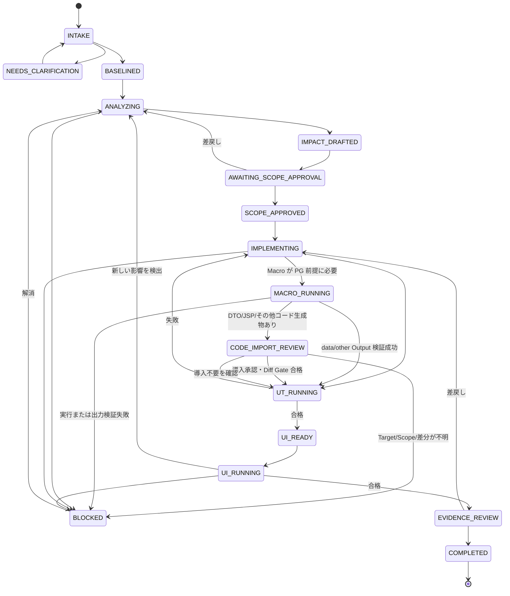

状態を省略して直接 `IMPLEMENTING` または `COMPLETED` に遷移することは禁止する。

---

# 6. 目標製品アーキテクチャ（未実装・未配備）

## 6.1 製品境界

目標製品の操作面は VS Code に統一する。Server は解析、状態管理、実行管理、データ管理、将来の AI Job を提供するが、別の業務 Web UI は持たない。以下はすべて未実装・未配備・未検証の目標構成である。

VS Code 側は二つの配布物で構成する。

1. **Agent Plugin**：Copilot の業務カスタマイズを配布する。
2. **VS Code Extension（VSIX）**：VS Code API を使う製品 UI と安全な実行連携を提供する。

両者は競合するものではなく、責務が異なる。

| 配布物 | 含めるもの | 含めないもの |
|---|---|---|
| Agent Plugin | Agents、Skills、Instructions、Prompts、Hooks、MCP 定義 | 複雑な Tree View、VCS UI、SecretStorage、独自 Editor |
| VSIX | Case Tree、Impact Viewer、Diff、承認 UI、Evidence Viewer、Git/SVN Workspace/Secret | AI の業務 Prompt を Extension Code に埋め込まない |
| Server/Core | Canonical State、解析、Policy、Execution、Artifact、Projection | 利用者向け独立 Web 画面、Copilot UI の模倣 |

## 6.2 全体構成

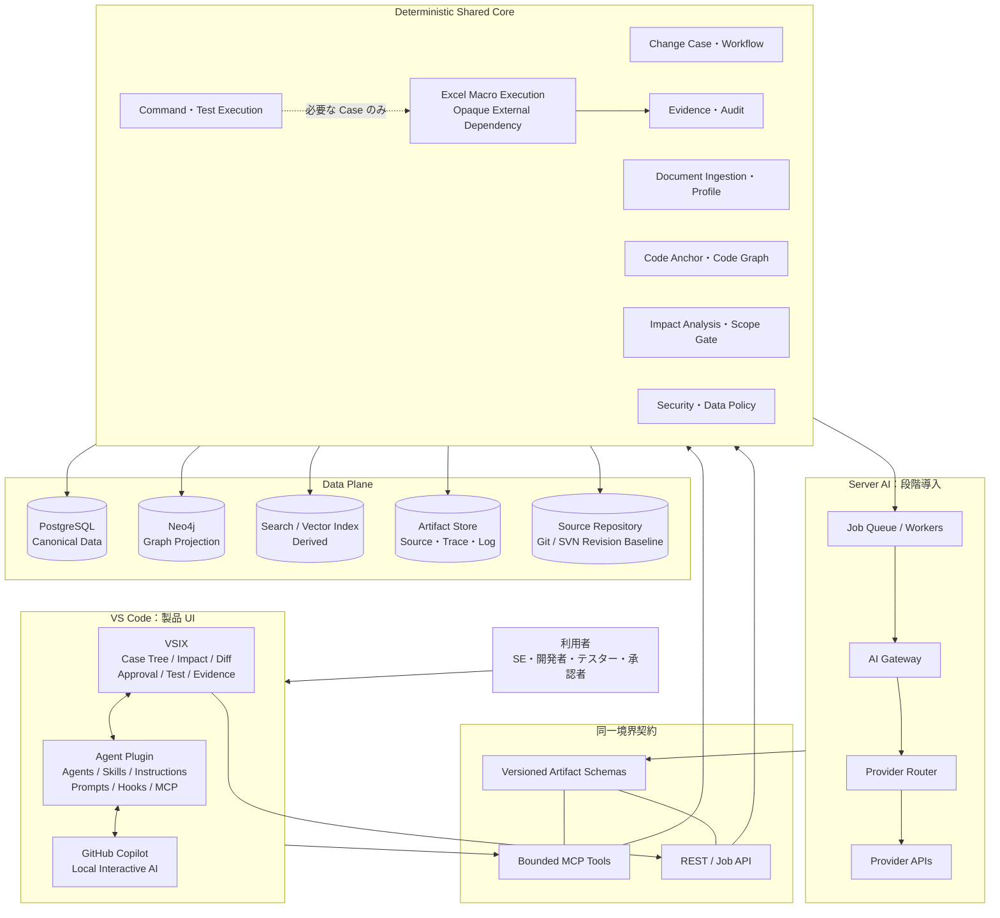

## 6.3 レイヤ責務

| レイヤ | 主責務 | 禁止する依存 |
|---|---|---|
| Presentation | VS Code 上の表示、入力、差分、承認操作 | Canonical DB への直接 SQL |
| Agent Customization | Copilot の役割・手順・文脈組立 | Workflow 状態の独自保存 |
| Boundary | MCP/REST/Job、Auth、Schema Validation | Provider 固有の業務判断 |
| Application | Use Case、State Transition、Authorization | UI への直接依存 |
| Domain | Case、Scope、Artifact、Evidence、Policy | VS Code、Neo4j、Playwright SDK |
| Analysis | Document/Code/Graph/RAG/Runtime Enrichment | AI の自由推測を確定値として保存 |
| Execution | Isolated Source Workspace、Command、UT、UI、必要時の Excel Macro、Artifact Capture | 承認なしの外部副作用、Macro 内部解析 |
| Infrastructure | PostgreSQL、Neo4j、Index、Git/SVN、Storage、AI Provider | Domain State の独自解釈 |

## 6.4 主要コンポーネント

### VSIX

- Change Case Explorer
- Request Intake Editor
- Baseline/Snapshot Viewer
- Context & Retrieval Inspector
- Impact Graph/Path Viewer
- Unknown & Coverage Gap Panel
- Scope Review/Diff Editor
- Approval Command
- Coding Task Panel
- UT/UI Execution Monitor
- Evidence Manifest Viewer
- Project Profile Selector
- Server Connection/Health
- SecretStorage による Token 管理

### Shared Core

- `ChangeCaseService`
- `ProjectOnboardingService`
- `SourceBaselineService`
- `DocumentCanonicalizationService`
- `CodeIndexService`
- `ImpactAnalysisService`
- `ScopeApprovalService`
- `CodingTaskService`
- `TestPlanningService`
- `ExcelMacroExecutionService`
- `ExecutionAuthorizationService`
- `EvidenceService`
- `ProjectionService`
- `AiJobOrchestrationService`

### Version Control Infrastructure

- `GitVersionControlAdapter`
- `SvnVersionControlAdapter`
- `SourceWorkspaceManager`
- `SourceChangeSetNormalizer`
- `SourceCommitAuthorizationService`

### Worker

- Document Extraction Worker
- Code Parsing Worker
- Search Index Worker
- Neo4j Projection Worker
- Runtime Enrichment Worker
- UT Execution Worker
- Playwright Worker
- Excel Macro Execution Worker
- Evidence Packaging Worker
- Server AI Worker

## 6.5 Local-first と Server の分担

| 処理 | Local Copilot | Server/Core | Server AI |
|---|---:|---:|---:|
| 要求との対話 | 主 | 状態・Schema | 補助／Batch |
| Project/Revision 固定 | 表示 | 主 | 不可 |
| 決定論的 Code 解析 | 参照 | 主 | 不可 |
| Impact 候補説明 | 主 | Context 作成・検証 | 代替可能 |
| Scope 承認 | UI | 主 | 不可 |
| コード編集 | 主経路 | Scope Gate | Policy 許可時のみ |
| Command/UT 実行 | Tool 要求 | 主 | Tool 経由のみ |
| UI 自動テスト | 起動・確認 | 主 | Test Case 候補のみ |
| Evidence 確定 | 表示 | 主 | 不可 |

Local Copilot のみ利用可能な案件では、Server は `WAITING_FOR_INTERACTIVE_COPILOT` 状態で bounded context と Coding Task を準備し、利用者が VS Code 内で Copilot を起動する。AI API が利用できる案件では、同じ Task を Server AI Channel に Dispatch できる。

## 6.6 対象プロジェクトの Version Control Adapter

ScopeArc 自身の Release 管理と、分析対象となる顧客 Java Web 工程の Version Control を分離する。対象工程は Git、SVN のどちらでもよく、Domain Core は VCS 固有用語ではなく共通 Contract を使用する。

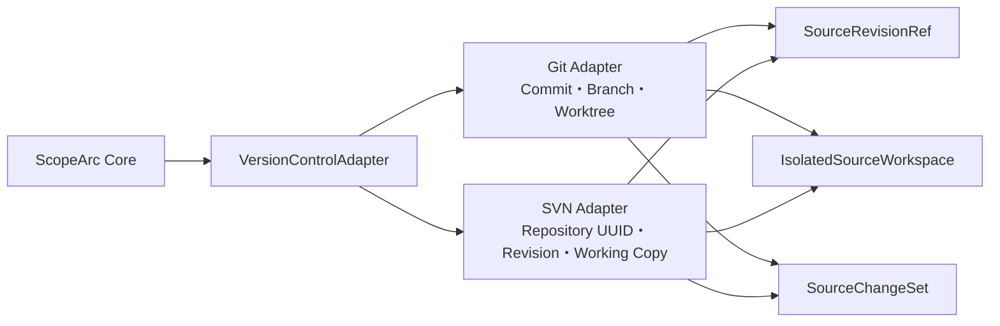

### 6.6.1 共通 Contract

| Contract | 役割 |
|---|---|
| `SourceRepositoryRef` | VCS Type、Repository Identity、接続先、Project Root を表す |
| `SourceRevisionRef` | 解析・承認・テスト対象となる不変 Revision を表す |
| `SourceWorkspaceRef` | PG/UT を行う隔離 Workspace と Base Revision を表す |
| `SourcePathRef` | Repository-relative Path と Module/Project Root を表す |
| `SourceChangeSet` | Added/Modified/Deleted/Renamed、Diff、Property Change を正規化する |
| `SourceStatusSnapshot` | Workspace の変更、混在 Revision、未追跡対象、外部参照を表す |

```json
{
  "system_variant": "current|migrated",
  "vcs_type": "git|svn",
  "repository_id": "VCR-...",
  "repository_identity": "verified-id-or-digest",
  "project_root": "repository-relative/path",
  "revision_id": "normalized-revision-id",
  "native_revision": {
    "git_commit_sha": null,
    "svn_repository_uuid": null,
    "svn_revision_number": null,
    "svn_peg_revision": null
  },
  "source_tree_digest": "sha256:..."
}
```

### 6.6.2 Git と SVN の対応

| 関心事 | Git | SVN |
|---|---|---|
| Repository Identity | Remote/Repository ID | Repository Root + Repository UUID |
| 不変 Revision | Commit SHA | Revision Number + Repository-relative Path + Peg Revision |
| Branch/Tag | Ref | `trunk/branches/tags` 等の Repository Path |
| 隔離作業領域 | Branch + Worktree または Clone | 固定 Revision から Checkout した独立 Working Copy |
| 状態取得 | status/diff/tree | info/status/diff/list/property |
| 変更証跡 | Commit/Working Tree Diff | Working Copy Diff + Property Change |
| 外部参照 | Submodule 等 | `svn:externals` |
| 注意事項 | Detached/Dirty/Untracked | Mixed Revision/Switched Path/Local Property Change |

SVN Revision Number だけでは対象 Subtree を一意に説明できないため、Repository UUID、Repository-relative Path、Peg Revision、Source Tree Digest を併用する。Mixed-revision Working Copy は既定で Baseline に採用せず、単一 Revision に揃えるか、明示的な Composite Snapshot として承認する。

Git Submodule と `svn:externals` は親 Revision だけでは内容が固定されない場合があるため、実際に解決された Repository Identity、Path、Revision、Content Digest を `ExternalDependencySnapshot` に保存する。Revision が固定されていない External は `external_revision_unpinned` とし、正式な Baseline を fail-closed にする。

### 6.6.3 Scope と Evidence への影響

- `ApprovedChangeScope` は Git Branch や SVN Path ではなく `SourceRevisionRef` と `SourcePathRef` に Binding する。
- Diff Gate は `SourceChangeSet` を検査し、Git/SVN 固有出力を直接業務判断に使わない。
- SVN の Property Change、Switched Path、Externals 変更も Scope 対象に含める。
- Git Commit または SVN Commit 後は新しい `SourceRevisionRef` を発行する。
- UT/UI/Evidence は VCS Type に関係なく同じ Case、Baseline、Revision ID に結び付ける。
- Macro が生成した DTO、JSP、その他のコードを取り込んだ場合も、導入結果を `SourceChangeSet` に含め、VCS Status/Diff を再確認した上で正式な Git Commit または SVN Commit の対象にする。Artifact Store に置いただけでは正式ファイルとみなさない。
- VCS Credential は VSIX SecretStorage または Server Secret Store で扱い、AI Context に渡さない。

PG/UT の既定成果は未確定の `SourceChangeSet` とし、AI が自動で Repository へ確定しない。Git の Commit、Git の Push、SVN の Commit はそれぞれ別の副作用として扱い、Review 済み ChangeSet Digest、対象 Repository/Path、利用者、Commit Message、期限を持つ `SourceCommitAuthorization` を要求する。特に SVN Commit は中央 Repository を直接更新するため、Git の Local Commit と同じ権限として扱わない。

---

# 7. GitHub Copilot カスタマイズ設計（未作成・未検証）

## 7.1 必要性の判断

画面に表示されているすべての機能を使うこと自体は目的ではない。本工程では次の理由で採用する。

| 機能 | 必要度 | 判断理由 |
|---|---:|---|
| Agents | 高 | 影響分析、実装、テストでは目的・許可 Tool・完了条件が異なるため |
| Skills | 高 | 日本の業務文書、Struts/Java 解析、UT/UI、Evidence の手順を再利用するため |
| Instructions | 高 | 全 Agent に共通する Scope、言語、根拠、禁止事項を一元化するため |
| Prompts | 中 | Case 開始、再解析、証跡作成など定型操作を短縮するため |
| Hooks | 中〜高 | Copilot が Tool を呼ぶ直前と直後に機械的検査を行うため |
| MCP Servers | 高 | Copilot と Core 間を限定 Tool で接続し、DB や Shell を直接公開しないため |
| Plugins | 高 | 上記資産を案件横断でチームへ一括配布し、版管理するため |

画面に表示された `Agents: 3`、`Skills: 11`、`Prompts: 7`、`Hooks: 1`、`MCP Servers: 1` は、利用可能な入口の参考情報に過ぎず、ScopeArc の資産が作成済みであることを示さない。本設計で候補とする **3 Agents、6 Core Skills、共通 Instructions、7 Prompts、最小 Hook Policy、1 Bounded MCP Server** はすべて未作成・未検証である。11 Skills の採否、重複、汎用、案件固有の分類も未完了である。

## 7.2 Custom Agents

初期構成は三つを候補とする。Agent 数を機能数に合わせて増やしすぎず、責務と承認境界で分離する。三つとも未作成・未検証である。

### Agent 1：`change-impact-analyst`

目的：顧客文を Case 化し、根拠付き Impact Draft を作る。

許可 Tool：読み取り系 Case、Document、Code Graph、Search、Impact Draft 更新。

禁止 Tool：Source 編集、Command 実行、Scope 承認。

完了条件：

- 顧客原文と解釈を分離した
- Candidate ごとに Evidence または Unknown 理由がある
- 設計書とコードの差異状態を出した
- Required Runtime Check を出した
- `ImpactAssessmentDraft` Schema に適合した

### Agent 2：`implementation-ut-engineer`

目的：承認範囲内で PG と UT を行う。

許可 Tool：Approved Coding Task 取得、許可 File 編集、許可 Command、Diff Validation、UT Result 登録。

禁止 Tool：Scope 追加、Approval、未許可 Environment への操作。

完了条件：

- Scope 外差分がない
- Required Check と UT が実行された
- Failure/Skipped/Blocked を明示した
- Revision と Result が記録された

### Agent 3：`ui-evidence-verifier`

目的：UI Test Case を実行し、Evidence を完成させる。

許可 Tool：Test Plan 取得、Data Binding 確認、Playwright 実行、Artifact 登録、Manifest 検証。

禁止 Tool：曖昧 Locator の強行、対象外 Record 更新、Evidence の手動改変。

完了条件：

- Screen/Record/Action が一意に確認された
- Expected Result が機械判定または Reviewer 判定に結び付く
- Trace、Screenshot、Log が Execution と結び付く
- Coverage Report が作られた

## 7.3 Skills

初期版では以下の Skill を必須とする。

| Skill | 内容 | 再利用単位 |
|---|---|---|
| `request-to-change-case` | 日本語顧客文の構造化、質問抽出、受入条件候補 | 全案件共通 + 業務辞書 |
| `legacy-java-impact-analysis` | JSP/Struts/Spring/XML/SQL の Anchor-first 解析 | Framework Profile |
| `design-code-reconciliation` | 設計書とコードの差異分類、移行・矛盾管理 | Document Profile |
| `approved-scope-pg-ut` | Scope 内編集、UT 選定、Diff Gate | Build Adapter |
| `playwright-business-case` | Case/Data/Locator/Trace の fail-closed 実行 | UI Profile |
| `evidence-delivery` | Manifest、報告書、Coverage、Hash 検証 | 全案件共通 |

Skill は Prompt 文の集合ではない。必要な Schema、チェックリスト、参照資料、Script、完了条件を一つの再利用パッケージにする。

## 7.4 Instructions

共通 Instructions には最低限次を記載する。

1. 回答言語は原則日本語、Identifier はソース通りとする。
2. 対象工程の実コードを実装基準とするが、顧客期待仕様と同一視しない。対象コードは本版では未受領である。
3. 根拠のない影響項目を確定と記載しない。
4. `unresolved`、`unknown`、`runtime_required`、`coverage_gap` を削除しない。
5. `ApprovedChangeScope` がなければ編集・Command を実行しない。
6. 許可範囲を越える必要を発見した場合は停止し、Scope Change Request を作る。
7. Test 未実行を Passed と記載しない。
8. Secret、個人情報、本番 Data を Prompt／Log に出力しない。
9. Source 全体は Canonical Store から参照し、断片だけで変更判断しない。
10. 成果物には Revision、Snapshot、Execution、Evidence を明記する。

## 7.5 Prompts

Prompts は便利な入口であり、権限制御には利用しない。

| Command 例 | 用途 |
|---|---|
| `/change-intake` | 選択文または Ticket から Case Draft を作成 |
| `/impact-analyze` | 現在の Baseline で Impact Draft を更新 |
| `/scope-review` | Draft と根拠を承認画面に表示 |
| `/start-pg-ut` | Approved Coding Task を開く |
| `/run-ui-case` | 選択 Case の UI 実行計画を確認・開始 |
| `/build-evidence` | Manifest と納品用報告を生成 |
| `/explain-unknowns` | 未解決項目と追加確認方法を説明 |

## 7.6 Hooks

本工程では Hooks を必要候補とする。ただし採用、組織設定、Client 対応、実行証跡は未完了である。Hook を唯一の Security Boundary にせず、Server/Core でも同じ検査を実装する設計候補とする。

### 最小 Hook 構成

| Hook | タイミング | 処理 | 失敗時 |
|---|---|---|---|
| `PreToolUse` | MCP/Command 実行前 | Case、Approved Scope、Tool、Argument、Revision を検査 | 実行拒否 |
| `PostToolUse` | 実行後 | Exit、Output Digest、変更 File、Artifact を回収 | Case を `evidence_incomplete` にする |
| Session End 相当 | 対話終了時 | 未登録差分、未完了 Task、Secret 混入を検査 | Completion を拒否 |

### Hook で行わないこと

- AI 出力の業務的正しさの承認
- PostgreSQL Workflow State の代替
- 複雑な Code Graph 解析
- 長時間 UT／UI Test の同期実行
- Secret の保存

## 7.7 MCP Server

MCP は Copilot に DB、Neo4j、Shell を直接公開するものではない。業務意味を持つ bounded tool のみを提供する。

### Tool Group

| Group | Tool 例 | Side Effect |
|---|---|---:|
| Intake | `get_change_case`, `update_case_draft` | 限定 |
| Context | `get_context_package`, `read_code_anchor`, `explain_graph_path` | なし |
| Impact | `record_impact_draft`, `list_unknowns` | 限定 |
| Scope | `get_approved_scope`, `request_scope_change` | Approval は不可 |
| Coding | `get_coding_task`, `validate_task_diff` | 読取／検査 |
| Execution | `run_authorized_command` | あり・承認必須 |
| Generated Code Import | `create_code_import_plan`, `get_code_import_plan`, `apply_approved_code_import`, `rollback_code_import` | あり・専用承認必須 |
| Test | `get_test_plan`, `run_authorized_ui_case` | あり・承認必須 |
| Evidence | `record_task_result`, `get_evidence_manifest` | 限定 |

すべての Tool Call に `project_id`、`change_case_id`、`expected_revision`、`idempotency_key`、`client_capability_version` を要求する。

## 7.8 Agent Plugin と VSIX の版管理

同一 Release に次を含める設計候補である。Package、Manifest、署名、Install、Rollback はすべて未作成・未検証である。

```text
scopearc-release-1.2.0/
├── agent-plugin/
│   ├── agents/
│   ├── skills/
│   ├── instructions/
│   ├── prompts/
│   ├── hooks/
│   └── mcp/
├── vscode-extension/
│   └── scopearc-1.2.0.vsix
├── contracts/
│   ├── schemas/
│   └── compatibility.json
├── checksums.txt
├── release-manifest.json
└── RELEASE_NOTES_ja.md
```

Version は SemVer を採用する。

- MAJOR：Artifact Schema または Tool Contract の破壊的変更
- MINOR：後方互換な Agent、Skill、Tool、画面追加
- PATCH：Prompt、説明、Bug Fix、非破壊的 Policy 修正

Agent Plugin、VSIX、MCP Server、Schema Catalog の互換範囲を `compatibility.json` に明記する。

---

# 8. Server AI アーキテクチャ（未実装・未接続）

## 8.1 導入方針

Server AI は将来対応ではなく、最初から契約上の拡張点を設ける。ただし、初期 Release で外部 AI API を必須にしない。Local Copilot だけでも主要 Flow を完結できることを保つ。

## 8.2 AI Gateway

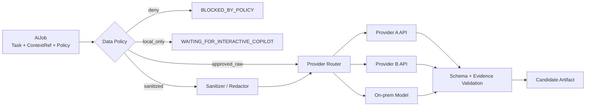

AI Gateway の責務：

- Provider-neutral Request/Response
- Model Capability と Policy による Routing
- Timeout、Retry、Rate Limit、Circuit Breaker
- Prompt/Context Template Version
- Structured Output Schema Validation
- Token/Cost/Latency/Audit
- Data Classification、Masking、Redaction
- Provider Response の原本 Hash と Candidate Artifact の保存

## 8.3 Job Contract

```json
{
  "job_id": "AIJ-...",
  "job_type": "IMPACT_DRAFT",
  "project_id": "PRJ-...",
  "change_case_id": "CC-...",
  "baseline_revision": "git-sha",
  "context_package_id": "CTX-...",
  "approved_scope_id": null,
  "channel_policy": "LOCAL_OR_SANITIZED_SERVER",
  "required_output_schema": "impact-assessment-draft/1.0",
  "idempotency_key": "...",
  "status": "QUEUED"
}
```

コード編集 Job では `approved_scope_id` を必須にする。Impact Draft Job では Scope がまだ存在しないため null を許容するが、書込み Tool は付与しない。

## 8.4 Local Copilot と Server AI の同一契約

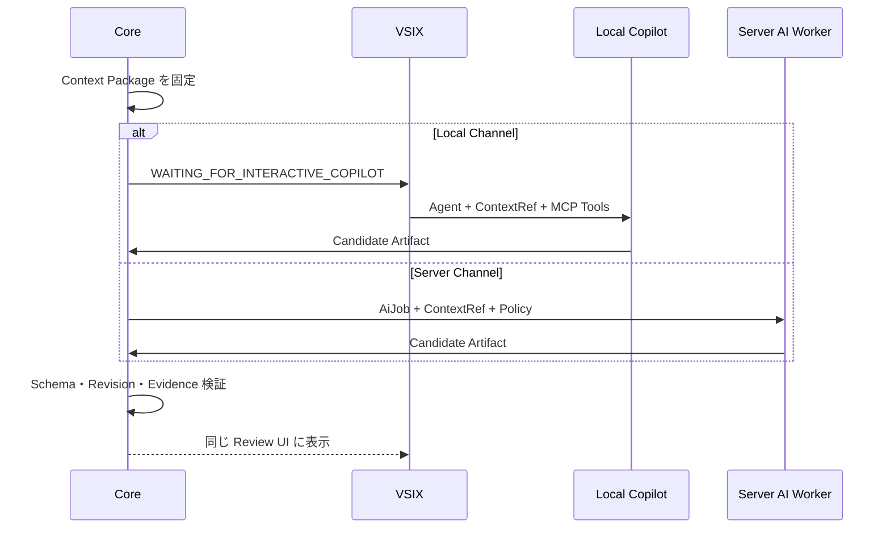

Channel が違っても、正式成果物の ID、Schema、Approval、Evidence は同じにする。これにより、将来 Provider を追加しても業務 Flow を作り直す必要がない。

## 8.5 外部送信ポリシー

| Policy | 送信可能内容 | 典型用途 |
|---|---|---|
| `local_only` | 外部 API 送信なし | 機密コード、顧客制約あり |
| `metadata_only` | 識別子を匿名化した Graph/統計 | 大規模関係分析 |
| `sanitized_context` | Redaction 済み bounded context | 影響説明、テスト観点 |
| `approved_source` | 明示承認された Source 範囲 | Server-side Coding Pilot |

Policy 判定結果、Rule Version、Masking Result、送信 Digest を Audit に残す。

---

# 9. 影響分析設計（未実装・未検証）

## 9.1 原則

影響分析は「RAG に質問して回答を得る」機能ではない。以下の順序を固定する。

1. Baseline を固定する。
2. 設計書 Fact と Code Anchor を決定論的に生成する。
3. Code Graph と設計差異を構築する。
4. Runtime が必要な関係を分離する。
5. Retrieval 候補を作り、Filter、Suppression、Merge、Re-rank を記録する。
6. bounded Context Package を作る。
7. AI が説明と候補を生成する。
8. Schema、Evidence、Revision を検証する。
9. 人が Approved Scope に確定する。

AI は Anchor や Graph を発明してはならない。AI が新しい識別子を提案した場合は、Core が Version Control Adapter による Source Readback または Document Readback で存在確認する。

## 9.2 設計書の Canonical 化

### 対応形式

- Excel：画面設計、テーブル定義、項目定義、テスト仕様
- Word：機能仕様、運用手順、変更履歴
- PDF：承認済み設計、外部仕様、帳票
- PowerPoint：業務フロー、画面遷移
- CSV/TSV：コード表、Migration Mapping
- 画像：OCR 対象。ただし原画像と OCR Confidence を保持

### Canonical Model

| Object | 主な属性 |
|---|---|
| `DocumentSource` | source_id、path、media_type、hash、version、received_at |
| `DocumentRegion` | page/sheet、range、parent_region、layout、extractor_version |
| `DesignFact` | fact_type、business_key、value、source_region、confidence |
| `DesignRelation` | from_fact、relation_type、to_fact、source_region |
| `DocumentProfile` | project、classification rule、layout rule、vocabulary、approval |

文書を Chunk に分割して検索する場合も、Chunk は Derived Index であり、Fact と Source Region を正本とする。検索結果から原本の Page/Sheet/Range に戻れなければ Evidence として採用しない。

## 9.3 設計書とコードの差異状態

| State | 意味 | 取り扱い |
|---|---|---|
| `aligned` | 設計記述とコードが一致 | 通常の根拠 |
| `partial` | 一部のみ一致 | 不足部分を Unknown または追加 Scope 候補にする |
| `code_only` | コードにのみ存在 | 対象工程の実コード確認後に現行挙動として記録し、設計追補候補にする。現在は未確認 |
| `design_only` | 設計書にのみ存在 | 未実装、廃止、移行済みの確認が必要 |
| `conflict` | 同じ対象で内容が矛盾 | 自動確定せず、人の判断を要求 |
| `migrated` | 名称・画面・処理が別対象へ移行 | Migration Relation を保存 |
| `unresolved` | 対応先を特定できない | 「影響なし」に変換しない |

## 9.4 Code Anchor

Anchor は AI が参照するコードの安定した住所である。

```json
{
  "anchor_id": "ANC-...",
  "project_id": "PRJ-...",
  "revision": "git-sha",
  "file_path": "src/main/java/.../CustomerAction.java",
  "symbol_kind": "method",
  "symbol_name": "search",
  "qualified_name": "...CustomerAction#search",
  "start_line": 120,
  "end_line": 184,
  "content_digest": "sha256:...",
  "parser": "tree-sitter-java",
  "parser_version": "...",
  "resolution_status": "verified"
}
```

Line 番号だけを識別子にしない。Symbol と Content Digest を併用し、Revision が変わったときに Rehydrate する。Rehydrate できない Anchor は `stale` とする。

## 9.5 Java Web Framework Adapter

| Adapter | 抽出・解決対象 | 未解決時の扱い |
|---|---|---|
| Java | Class、Method、Field、Call、Inheritance | Reflection は runtime_required |
| Spring MVC | Annotation/XML Mapping、Controller、Handler、Model、View Resolver、JSP/Thymeleaf、REST Endpoint | 動的 Route/View、Interceptor 分岐は candidate または runtime_required |
| Struts 1 | struts-config、Action、Form、Forward、JSP | Module/Forward 動的変更は runtime_required |
| Spring Boot MVC（将来） | Auto Configuration、Controller、Configuration Property、Profile、Actuator 情報 | 実行 Profile に依存する Bean は runtime_required |
| JSP/JSTL | Form、Link、Tag、EL、Include、JS 呼出 | Scriptlet 動的値は confidence を下げる |
| XML | Bean、Mapping、SQL Map、Config Reference | Property placeholder は環境 Snapshot を要求 |
| SQL | Statement、Table、Column、Read/Write | Dynamic SQL は candidate + runtime_required |
| Persistence | MyBatis Mapper、JPA Repository、JdbcTemplate、DAO | ORM の動的 Query は runtime_required |
| JavaScript | Event、AJAX、URL、DOM Target | Runtime 生成 selector は UI discovery 対象 |
| Test | Target Symbol、Fixture、Case、Assertion | 実行対象不明は coverage_gap |

### 9.5.1 Framework 非依存の Canonical Relation

Struts 1 と Spring MVC の固有構造を、そのまま Domain Core に持ち込まない。各 Adapter は解析結果を共通 Relation に正規化する。

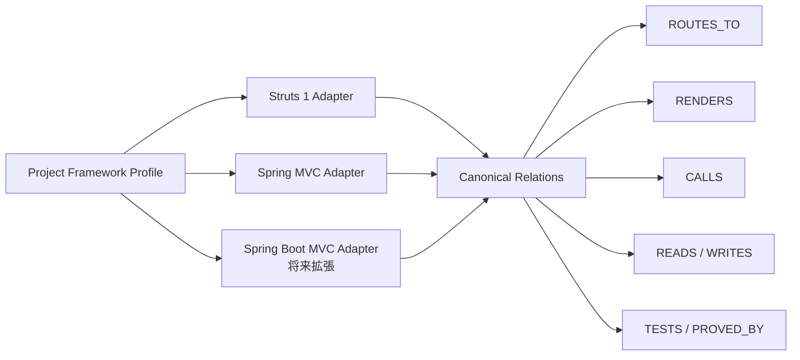

これにより、影響分析、Neo4j Query、Approved Scope、PG/UT、UI Evidence は Framework が変わっても同じ Contract を利用できる。

### 9.5.2 Spring MVC の代表的な影響経路

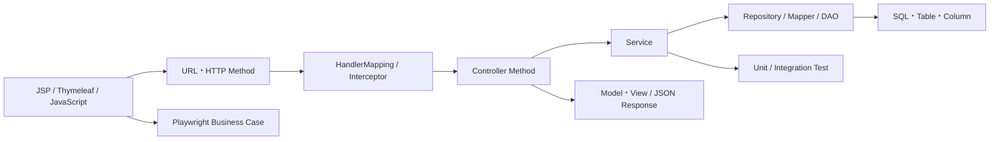

Spring MVC 案件では、URL 文字列だけで Controller を決めない。HTTP Method、Path Variable、Request Parameter、Content Type、Interceptor、View Resolver、実行 Profile を含めて解決する。静的に一意化できない場合は `candidate` または `runtime_required` とする。

## 9.6 Excel Macro 外部実行依存

Excel Macro は、Java Web の UI や CodeGraph の解析対象ではない。VBA Module、Procedure、Call Graph、内部データフローを抽出・推定せず、既存 Macro を Web 化、Java 化、書き換えしない。Macro は **コード変更（PG）の一工程として必要な場合にだけ使用する、既存の外部ツール** として扱う。初期実行環境は Windows Excel とし、Excel Version、Windows Version、COM/デスクトップ自動化方式、Trust Center Policy は Project Profile で固定する。

ScopeArc が管理するのは Macro の内部ロジックではなく、実行に必要な環境、入力ファイル、利用者が指定した Excel 内ボタン、生成ファイル、および実行結果である。したがって Macro に関する記録は CodeGraph の `CodeAnchor` にはならず、`ExcelMacroExecutionProfile` と `ExcelMacroExecution` の実行・証跡メタデータに限定する。

### 9.6.1 管理するメタデータ（Macro の解析ではない）

| 対象 | 管理する情報 | 扱い |
|---|---|---|
| Workbook | `.xlsm`/`.xlam`/`.xlsb` の参照先、Hash、版、原本保管先 | Binary Artifact として保存。内部を解析しない |
| Excel Environment | Excel Version、OS、Locale、Add-in、Trust Center/署名 Policy | 実行前に確認し Snapshot 化 |
| Input File | Path/参照先、Business Key、Hash、Source Type（existing/external/generated） | 既存ファイルを優先利用し、原本は Read-only で扱う |
| Configured Button | Sheet、Caption/Shape 等、利用者が事前に指定した操作対象 | 自動推定せず、複数候補・不一致は停止 |
| Generated Output | 期待する File 名/Path/Pattern、Output Type（`dto/jsp/java/xml/sql/config/data/other`）、Hash、Size、Timestamp、業務 Key/Schema | 実行後に検証して Evidence 化。工程へ自動コピーしない |
| Code Import Candidate | 生成コードの候補 Target Path、既存 Target Hash、Scope、Diff、導入理由 | `GeneratedCodeImportPlan` として人が確認するまで Staging 外に置く |
| System Variant | `current` / `migrated`、対象 Repository/Revision、移行対応関係 | Variant を省略した Macro Execution は正式化しない |
| Execution | Operator、Authorization、開始・終了時刻、結果、Log、Error/Warning | Case と Execution ID に紐付ける |

### 9.6.2 外部実行境界

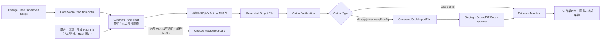

Macro の実行は業務システムの実行経路や Java コードの影響関係を証明するものではない。コード変更中に必要な入力・生成ファイルを準備する **PG 内の補助 Step** として明示し、実行失敗時は PG の後続工程（生成コード導入、Diff Gate、UT）を継続せず `blocked` とする。Macro 不要の Case では Macro Evidence を要求しない。

### 9.6.3 実行契約

```text
ExcelMacroExecutionProfile
├── workbook_ref / workbook_digest
├── system_variant: current | migrated
├── excel_version / os / locale / addins
├── macro_security_policy
├── input_file_bindings[]
│   ├── source_type: existing | external | generated
│   ├── location / business_key / content_digest
│   └── read_only / selection_rule
├── configured_sheet / configured_button
├── expected_output_bindings[]
│   ├── output_type: dto | jsp | java | xml | sql | config | data | other
│   ├── generated_digest / candidate_target_paths[]
│   └── import_policy: none | staged | approved
├── generated_code_import_plan_ref (optional)
├── cleanup_policy
├── execution_authorization
└── evidence_requirements
```

`configured_sheet` と `configured_button` は Project Profile または実行前承認で明示する。VBA の `OnAction`、Procedure 名、Call 関係を Macro から逆算して補完しない。入力ファイルは `existing`、`external`、`generated` のいずれでもよいが、候補が 0 件または複数件で一意に選べない場合は自動選択せず停止する。

実行時は Workbook と Environment の Hash/Version を確認し、入力ファイルの原本を変更しない。指定された Excel 内ボタンを一度だけ操作し、生成ファイルを閉じる前後で列挙する。生成ファイルは名前だけでなく Content Digest、Size、Timestamp、期待 Schema または業務 Key で検証する。

`output_type=dto|jsp|java|xml|sql|config` の場合は、生成ファイルを Source Workspace の候補として記録するだけで、工程ファイルへ直接上書きしない。`GeneratedCodeImportPlan` の Target Path、既存ファイルとの差分、Scope 内であること、導入承認、Rollback 用の元 Hash を確認してから Staging に取り込む。DTO と JSP は正式なプロジェクトファイルになり得るため、導入後は通常の `SourceChangeSet` に含める。

### 9.6.4 Target Hash と衝突時の扱い

`Target Hash` は、生成物を導入しようとする先の既存ファイル（例：`XxxDto.java`、`xxx.jsp`）を、計画作成時点で読み取った内容の指紋である。`Source Hash` は Macro が生成したファイルの指紋、`Target Hash` は導入先に現在存在するファイルの指紋であり、同じものではない。

適用直前に再読取した Target Hash が計画時の Hash と一致しない場合、誰かの変更、別 Revision、生成先の取り違え、または未管理変更がある可能性がある。既定動作は自動上書きではなく `blocked` とし、次のいずれかを人が選んで新しい計画・承認を作る。

1. 現在のファイルと生成物の Diff を確認して再計画する。
2. 人が解決した Merge 結果を別の Source Hash として取り込む。
3. 既存ファイルを置換することを明示承認し、Rollback 用の元ファイルを保存する。

`Target Hash` 不一致を「生成物が正しい」と解釈して無視したり、既存ファイルを暗黙に上書きしたりしてはならない。

### 9.6.5 保全方針と対象外

- Macro Workbook、入力ファイル、生成ファイルの原本を変更せず、必要な場合は作業用 Copy を使う。
- VBA ソース、Macro Project、Procedure、Call Graph を CodeGraph に登録しない。Macro 内部の静的解析・推論・分割も行わない。
- Macro の書き換え、VBA 修正、Web 化、Java 化は別 Change Case とし、通常の Java Web 修正へ自動混入させない。
- 外部 DLL/COM/Network/Shell、動的 Path、Trust Center 制約などは Macro の内部を解析せず、実行 Policy と Environment Snapshot のリスクとして管理する。
- Macro 実行失敗、入力候補の曖昧さ、出力検証不能は `blocked` または `coverage_gap` とし、「画面が閉じた」「ボタンを押せた」だけで成功にしない。Macro の結果を UI 自動テストの合否に流用しない。
- Screenshot は補助証拠に留め、Input Hash、Configured Button、Output Hash、Log、Execution Result を必須 Evidence とする。

## 9.7 Retrieval Pipeline

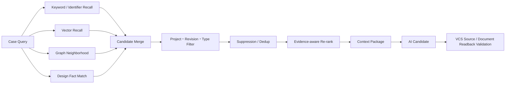

Retrieval Trace には以下を保存する。

- 各 Channel の Candidate ID と Raw Score
- Filter Rule と除外件数
- Suppression/Dedup の代表・統合先
- Re-rank Model/Rule Version と Final Score
- Context に採用／不採用と理由
- Token Budget と切り詰め理由
- Index Snapshot、Graph Snapshot、Document Snapshot

## 9.8 Context Package

Context Package は Prompt 文字列ではなく、版管理された Artifact とする。

```text
ContextPackage
├── case_summary
├── baseline
├── approved_document_facts
├── code_anchors
├── graph_paths
├── design_code_differences
├── runtime_evidence
├── unknowns
├── exclusions
├── retrieval_trace_ref
├── token_budget
└── content_digests
```

コード本文は Canonical Source から必要な File/Symbol 単位で取得する。保存上のコードを不可逆に小片化して正本を失わない。

## 9.9 Impact Assessment

### Impact Item

| 属性 | 説明 |
|---|---|
| `impact_type` | ui/backend/sql/db/batch/test/config/document |
| `target_ref` | Code Anchor、Design Fact、DB Object、Test Case |
| `reason` | 顧客要求との関係 |
| `graph_paths` | 関係経路 |
| `evidence_refs` | 原本参照 |
| `confidence` | deterministic/verified/candidate/weak |
| `resolution_status` | confirmed/unresolved/runtime_required |
| `change_hint` | 変更案。確定仕様ではない |
| `test_obligations` | 必須 UT/UI/DB Check |

### 影響範囲の例

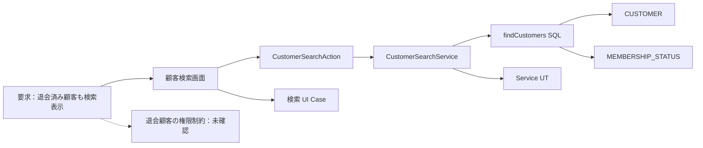

## 9.10 承認境界

`ImpactAssessmentDraft` と `ApprovedChangeScope` は別 Artifact とする。

Draft は AI または Analyst が何度でも更新できる。Approved Scope は承認者、Revision、Digest を持つ不変版とし、変更時は新 Version を発行する。

Scope の差分例：

```json
{
  "scope_id": "SCP-...-v3",
  "source_revision_ref": {
    "vcs_type": "git|svn",
    "revision_id": "normalized-revision-id"
  },
  "allowed": {
    "files": ["src/.../CustomerSearchService.java"],
    "symbols": ["...CustomerSearchService#search"],
    "db_objects": [],
    "commands": ["./gradlew test --tests ...CustomerSearchServiceTest"]
  },
  "forbidden": {
    "paths": ["config/prod/**", "db/production/**"],
    "operations": ["deploy", "production_write"]
  },
  "required_tests": ["UT-CUSTOMER-SEARCH-01", "UI-CUSTOMER-SEARCH-07"],
  "approval": {
    "approved_by": "user-id",
    "approved_at": "timestamp",
    "scope_digest": "sha256:..."
  }
}
```

---

# 10. PG・UT 設計（未実装・未検証）

## 10.1 実装開始条件

次が揃うまで Coding Task を `READY` にしない。

- Change Case が Baseline に固定されている
- Approved Scope が現 Revision に対して有効である
- Allowed Files/Symbols/Commands が空ではない
- 必須 Test Obligation が定義されている
- VCS に応じた隔離 Source Workspace を準備できる
- Secret/Data Policy を解決している
- 必要な Build Toolchain を確認している

## 10.2 Coding Task

```text
CodingTask
├── task_id / case_id / scope_id
├── source_revision_ref / source_workspace_ref
├── objective
├── acceptance_criteria
├── allowed_anchors
├── forbidden_paths
├── context_package_ref
├── required_commands
├── required_tests
├── output_contract
└── expiration
```

## 10.3 実装フロー

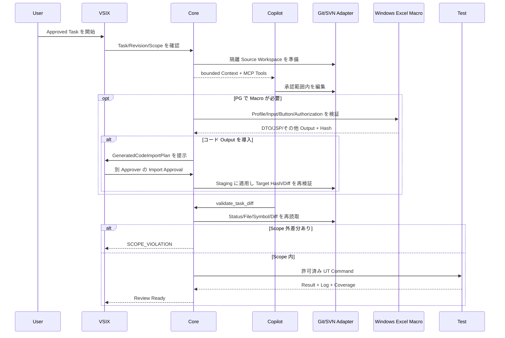

## 10.4 Diff Gate

Diff Gate は最低限次を検査する。

| Check | 合格条件 |
|---|---|
| Base Revision | Approved Scope と一致 |
| Changed Path | Allowed/Generated Policy 内 |
| Changed Symbol | Scope Anchor または承認された隣接変更 |
| Binary | 明示許可された Asset のみ |
| Secret Scan | 検出なし |
| Migration | Scope と Rollback/Forward 方針あり |
| Dependency | Lockfile と License/Security Check あり |
| Generated Code | Generator と入力が記録される |
| Generated Target Hash | 計画時と適用直前の Target Hash が一致し、衝突時は `blocked` になる |
| VCS Metadata | SVN Property/Switched/External、Git Submodule/Untracked を検査済み |
| Workspace Consistency | SVN Mixed Revision または Git Base 不一致がない |

行番号だけで Scope を判定しない。AST Symbol と Diff Hunk を Revision 上で再解決する。

## 10.5 UT 選定

UT は以下の優先順位で選定する。

1. 変更 Symbol を直接対象にする既存 Test
2. Graph の `tests` 関係にある Test
3. 同じ Service/Action/SQL を対象にする Test
4. 変更条件の境界値・異常系を補う新規 Test
5. Framework 起動を必要とする Integration Test

AI は Test 候補を作れるが、Core は対象 Symbol、実行 Command、Result を検証する。

## 10.6 UT Result

| State | 意味 |
|---|---|
| `passed` | 対象 Command が Exit 0 で期待 Assertion を完了 |
| `failed` | Product/Test のいずれかで失敗 |
| `blocked` | 環境、依存、Data、権限により実行不能 |
| `partial` | 必須 Test の一部のみ実行 |
| `not_run` | 未実行 |
| `flaky_suspected` | 再実行で結果が変動し原因未確定 |

`blocked`、`partial`、`not_run` は成功に集約しない。Reviewer が判断できるよう Coverage Gap として残す。

## 10.7 Scope Change Request

実装中に追加影響を発見した場合は、次を記録して停止する。

- 発見した File/Symbol/DB Object
- なぜ現 Scope では不十分か
- Evidence と Graph Path
- 追加リスクと追加 Test
- 現在の未コミット差分

承認者が新しい Scope Version を承認した後に再開する。

---

# 11. UI 自動テスト設計（未実装・未検証）

## 11.1 Case 中心モデル

UI 自動化の主語は Page Object でも Script でもなく業務 Test Case とする。

```text
BusinessTestCase
├── requirement_ref
├── preconditions
├── test_data_requirements
├── steps
├── expected_results
├── screen_identities
├── record_scopes
├── action_intents
├── cleanup_policy
└── evidence_requirements
```

実行時に `BusinessTestCase` を Environment 固有の `TestDataBinding` と `UiExecutionPlan` に解決する。

## 11.2 実行前 Gate

1. 対象 Environment と Base URL を確認する。
2. Build/Deployment Revision が Case Revision と一致することを確認する。
3. Test Data を一意の Business Key で準備・確認する。
4. Login Role と権限を確認する。
5. Screen Identity を URL、Heading、固定 Element の組合せで確認する。
6. 操作対象 Record を一意に絞る。
7. 操作 Button/Field の Locator が一意であることを確認する。
8. 副作用、Cleanup、再実行可能性を確認する。

一つでも確認できない場合は操作しない。

## 11.3 Locator Policy

優先順位：

1. `getByRole` と accessible name
2. `getByLabel`
3. 安定した `getByTestId`
4. 業務 Key を含む Record Scope 内の Role/Label
5. 合意済み stable attribute

禁止または要承認：

- `.first()`、`.last()` による曖昧性の隠蔽
- 行番号だけによる Record 選択
- 複数件一致する一般 Text
- DOM 構造に強く依存する長い CSS/XPath
- 実行ごとに変わる ID
- Screen Identity を確認しない直接操作
- 一意性 Assertion なしの destructive action

## 11.4 実行フロー

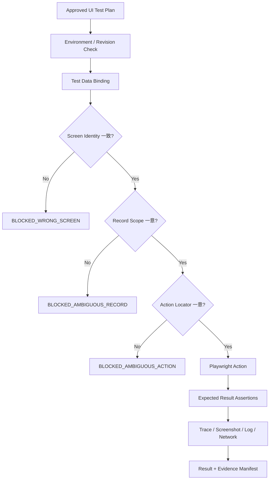

## 11.5 Test Data

| 項目 | 要件 |
|---|---|
| Business Key | UI と DB の両方から対象を識別できる |
| Environment | local/test/staging を明示する |
| Creation | Seed/API/SQL/UI のいずれで作成したか記録する |
| Baseline | 実行前状態の Digest または Snapshot を持つ |
| Mutation | どの Step がどの状態を変更したか記録する |
| Cleanup | rollback/delete/reset/retain-with-tag を明示する |
| Privacy | 個人情報は Synthetic または Masked Data を利用する |
| Parallelism | Case 間で Key が衝突しない |

## 11.6 Evidence Capture

| Artifact | 取得タイミング | 主用途 |
|---|---|---|
| Screenshot | 重要 Step 前後、Failure | 視覚的確認 |
| Playwright Trace | 全実行または Failure | DOM、Action、Network の再生 |
| Video | Policy で必要な Case | 操作順の補助証拠 |
| Console Log | 全実行 | Frontend Error |
| Network HAR/Log | 対象 API | Request/Response、Timing |
| Server Log Ref | 対象 Transaction | Backend 相関 |
| DB Verification | 明示された Expected Result | 永続化結果 |
| Accessibility Snapshot | 重要画面 | Role/Name と Locator 根拠 |

Screenshot は単独では合格証明にならない。Case、Step、Expected、Revision、Data Binding、Execution ID と組み合わせる。

## 11.7 Failure 分類

| Category | 例 | 戻り先 |
|---|---|---|
| `product_failure` | 期待結果と実装が不一致 | PG/Impact |
| `test_defect` | Locator、Assertion、Data 条件が誤り | Test Design |
| `environment_failure` | Server 停止、Build 不一致 | Environment |
| `data_failure` | 前提 Data 不足、競合 | Data Binding |
| `coverage_gap` | Expected を機械確認できない | Scope/Review |
| `new_impact_found` | 未想定の画面・API・DB 影響 | Impact Analysis |

## 11.8 （PG 補助）Excel Macro 外部実行 Step

本項は UI 自動テストの機能ではなく、PG（コード修正・機能実装）中に必要な場合だけ実行する補助 Step の実行設計を記載する。Excel Macro は Playwright の Browser Test や CodeGraph 解析に置き換えない。Macro 内部の VBA は読み取らず、操作対象と入出力を人が設定する。

### 実行手順

1. `ExcelMacroExecutionProfile`、Workbook Hash、Windows Excel/OS Environment、Macro Policy、実行 Authorization を確認する。初期対象は Windows Excel とする。
2. `existing`、`external`、`generated` の指定に従って入力候補を探索し、Hash と業務 Key で Binding する。原本は変更せず、候補が 0 件または複数件なら停止して人の選択を要求する。
3. 対象 Workbook を開き、Profile に事前設定された Worksheet と Button/Shape を確認する。Caption や座標を自動推定しない。
4. Excel 内の指定 Button を一度だけ操作する。対象が一意でない、画面が想定外、または確認できない場合は停止する。
5. Macro 実行中の Status、Error Dialog、外部 File/Network/Shell 副作用、生成先を Policy の範囲で監視する。内部 VBA の処理内容は解析しない。
6. 生成ファイル（DTO、JSP、その他の Java/XML/設定コード、データ）を列挙し、名前、Size、Hash、更新時刻、業務 Key、期待 Schema を検証する。
7. Workbook を保存・終了し、未保存変更、Lock File、残留 Process を確認する。
8. Screenshot、操作 Trace、Input/Output Hash、Excel Log、Error Dialog、Execution Result を Manifest に登録する。

### 実行方式

`ExcelMacroRunner` は Windows Excel 実行環境の Adapter として初期実装し、Windows COM または管理された Windows Desktop/Remote Desktop のいずれかを Project Profile で選択する。macOS Excel Automation は初期対象外であり、必要になった場合に別 Adapter として再審査する。同じ `ExcelMacroExecutionProfile` と Evidence Contract を返し、Runner は Macro 内部の VBA を解析する機能を持たない。

### Macro の合否

Excel の画面が閉じた、ボタンを押せた、ファイル名が生成された、だけでは成功としない。少なくとも Input Hash、Configured Button、Output Hash、Output Schema/業務 Key、Error/Warning の有無を検証する。DTO/JSP 等の生成コードは `GeneratedCodeImportPlan` と別承認を経ない限り工程ファイルに反映しない。生成ファイルの内容を検証できない場合は `coverage_gap`、Macro 自体が実行できない場合は `blocked` とする。

---

# 12. 成果物・証跡設計（未生成・未検証）

## 12.1 成果物一覧

| Phase | Artifact | 必須 | 状態 |
|---|---|---:|---|
| Intake | Request Original、Change Case、Open Questions | Yes | 未完了・未生成 |
| Baseline | Repository/Revision Manifest、Document Manifest | Yes | 未完了・未固定 |
| Analysis | Context Package、Retrieval Trace、Code Graph Snapshot | Yes | 未完了・未検証 |
| Impact | Impact Assessment Draft、Unknown Report | Yes | 未完了・未作成 |
| Approval | Approved Change Scope、Approval Grant | Yes | 未完了・未承認 |
| PG | Coding Task、Source ChangeSet/Diff、Scope Validation | Yes | 未完了・未実行 |
| UT | Test Selection、Command Log、JUnit Result、Coverage | Yes | 未完了・未実行 |
| UI | Business Test Case、Data Binding、Trace、Screenshot | 条件付き必須 | 未完了・未実行 |
| Excel Macro Execution | Workbook/Environment Manifest、Input File Binding、Configured Button Trace、Generated Output | 条件付き必須 | 未完了・未実行 |
| Generated Code Import | Import Plan、別承認、Target Hash/Diff、Staging、Apply/Rollback Result | DTO/JSP/その他コード Output の場合必須 | 未完了・未実行 |
| Evidence | Evidence Manifest、Coverage Report、Audit Log | Yes | 未完了・未検証 |
| Delivery | 影響分析書、変更仕様、テスト結果、未解決一覧 | Yes | 未完了・未納品 |

## 12.2 Evidence Chain

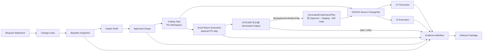

各 Arrow は ID 参照だけでなく、対象 Artifact の Digest を持つ。参照先が後から置換された場合は Manifest 検証に失敗する。

## 12.3 共通 Binding

対象 System Variant を持つ全 Artifact に次を必須付与する。Variant を持たない共通 Artifact も、関連する Case/Snapshot の Variant を参照できなければ正式化しない。

```json
{
  "artifact_id": "...",
  "artifact_type": "...",
  "schema_version": "1.0",
  "project_id": "PRJ-...",
  "change_case_id": "CC-...",
  "system_variant": "current|migrated",
  "snapshot_id": "SNP-...",
  "source_revision_ref": {
    "vcs_type": "git|svn",
    "revision_id": "..."
  },
  "environment_id": "...",
  "execution_id": "...",
  "producer": {
    "type": "core|human|local_copilot|server_ai|tool",
    "version": "..."
  },
  "created_at": "...",
  "content_digest": "sha256:...",
  "evidence_refs": []
}
```

Macro 関連 Artifact は共通の `execution_id` に加えて `macro_execution_id` を持ち、Workbook、Input、Configured Button、Output の同一実行を追跡できるようにする。Macro が不要な Case ではこの ID を生成しない。

## 12.4 Delivery Package 例

```text
CC-20260817-0042/
├── 00_manifest/
│   ├── evidence-manifest.json
│   ├── checksums.sha256
│   └── coverage-report.json
├── 01_request/
│   ├── request-original.txt
│   └── change-case.json
├── 02_baseline/
│   ├── source-revision.json
│   └── document-manifest.json
├── 03_impact/
│   ├── impact-assessment-ja.md
│   ├── impact-assessment.json
│   ├── graph-paths.json
│   └── unknowns.json
├── 04_approval/
│   └── approved-change-scope.json
├── 05_change/
│   ├── change-summary-ja.md
│   ├── source-diff.patch
│   ├── source-status.json
│   └── scope-validation.json
├── 06_ut/
│   ├── test-plan.json
│   ├── junit-results.xml
│   └── command-log.txt
├── 07_ui/
│   ├── test-cases/
│   ├── traces/
│   ├── screenshots/
│   └── ui-results.json
├── 08_macro/
│   ├── workbook-manifest.json
│   ├── input-bindings.json
│   ├── configured-button.json
│   ├── macro-execution.json
│   ├── screenshots/
│   ├── generated-outputs/
│   ├── output-verification.json
│   ├── generated-code-import-plan.json
│   ├── generated-code-import-approval.json
│   ├── generated-code-import-result.json
│   └── rollback-manifest.json
└── 09_delivery/
    ├── result-report-ja.md
    └── unresolved-items-ja.md
```

## 12.5 Coverage Report

Coverage は単純なコード行 Coverage に限定しない。

| Coverage 軸 | State |
|---|---|
| Requirement | covered / partial / not_covered |
| Impact Item | verified / candidate / unresolved |
| Approved Scope | implemented / not_implemented / superseded |
| UT Obligation | passed / failed / blocked / not_run |
| UI Obligation | passed / failed / blocked / not_run |
| Macro Execution（必要 Case のみ） | passed / blocked / not_run / coverage_gap |
| Evidence | complete / incomplete / invalid_digest |
| Environment | verified / mismatch / unknown |

Case 完了条件は、必須軸が `covered/verified/implemented/passed/complete` であること、または未達項目に対する明示的な Waiver があることとする。

---

# 13. データアーキテクチャ（未構築・未検証）

## 13.1 保存先の原則

PostgreSQL、Neo4j、Artifact Store、Search/Vector Index は本版では未構築・未接続・未検証である。以下は配置候補と正本性の目標設計であり、実環境の状態を示さない。

| Store | 役割 | 正本性 |
|---|---|---|
| Version Control System（Git/SVN） | Source と Revision の基準 | Source の正本 |
| PostgreSQL | Workflow、Canonical Fact、Artifact Metadata、Approval、Audit | 業務データの正本 |
| Artifact Store | 原設計書、Source Export、Trace、Screenshot、Log、Report | Binary/大容量 Artifact の正本 |
| Neo4j | Cross-domain Relationship Projection、Path Query | 派生・再構築可能 |
| Search/Vector Index | Recall、Ranking、Semantic Search | 派生・再構築可能 |
| Cache | 一時高速化 | 非正本 |

PostgreSQL、Neo4j、Search Index に同じ完全データをコピーしない。Canonical ID で結び、用途に必要な属性だけ Projection する。

## 13.2 PostgreSQL に置くもの

### Workflow と統制

- Project、Repository、Environment
- Change Case、State Transition
- Baseline、Snapshot、Revision
- Impact Draft、Approved Scope、Approval Grant
- Coding Task、Test Plan、Execution Authorization
- `ExcelMacroExecutionProfile`、`ExcelMacroExecution`（Workbook/Environment/Input/Button/Output の実行メタデータのみ）
- Artifact Metadata、Evidence Manifest、Audit Event
- AI Job、Provider Policy、Usage Record

### Canonical Analysis Fact

- Document Source、Region、Design Fact、Design Relation
- Code File、Symbol、Anchor、Static Edge、Resolution Status
- Runtime Evidence Metadata
- Retrieval Candidate/Trace Metadata
- Neo4j Projection Offset/Status

完全な Source、Office File、Trace、Video など大容量 Binary は Artifact Store に置き、PostgreSQL には URI、Hash、Size、Media Type、Retention を保存する。

Excel Macro については、Workbook、既存または外部 Input File、Generated Output、Excel Environment の参照先と Hash を Artifact Metadata として保持する。VBA Source、Module、Procedure、Call Graph など Macro 内部の解析 Fact は Canonical Data に作成しない。

## 13.3 Neo4j に置くもの

Neo4j は「何と何が、どの Snapshot で、どの根拠により関係するか」を高速に探索するために使う。

Excel Macro は Neo4j の影響グラフにも投影しない。PG の前提データとして実行した事実だけを `ExcelMacroExecution`／`Evidence` から参照でき、VBA 内部の Symbol や Call 関係は作成しない。

### Node Label

| Label | 例 | Projection 属性 |
|---|---|---|
| `Project` | 案件 | canonical_id、profile_version |
| `SystemVariant` | 現行／Migration 後の対象系統 | canonical_id、variant_key、profile_version、vcs_type |
| `Snapshot` | 解析時点 | canonical_id、vcs_type、source_revision_id、created_at |
| `Requirement` | 顧客要求／Change Case 要素 | canonical_id、case_id、type |
| `DesignArtifact` | 設計書 | canonical_id、version、hash |
| `DesignFact` | 画面項目、仕様、テーブル記述 | canonical_id、fact_type、confidence |
| `Screen` | JSP/画面 | canonical_id、name、route |
| `UIElement` | Button/Input/Link | canonical_id、role、stable_key |
| `Route` | URL/Mapping | canonical_id、http_method、pattern |
| `ControllerAction` | Struts Action/Spring Controller | canonical_id、qualified_name |
| `Service` | Service Class/Method | canonical_id、qualified_name |
| `CodeSymbol` | Method/Class/Field | canonical_id、anchor_id、kind |
| `SQLStatement` | SQL/Mapper Statement | canonical_id、statement_key |
| `Table` | DB Table/View | canonical_id、schema、name |
| `Column` | Column | canonical_id、name |
| `TestCase` | UT/UI/Integration Case | canonical_id、test_type |
| `Evidence` | Runtime/Test Evidence Metadata | canonical_id、evidence_type、digest |

すべての Node は最低限 `canonical_id`、`project_id`、`snapshot_id` を持つ。Code 関連 Node は `revision`、解析由来 Node は `parser_version` と `resolution_status`、Evidence 由来 Node は `evidence_id` を持つ。

### Relationship Type

| Relationship | 意味 |
|---|---|
| `DESCRIBES` | 設計書が画面・処理・DB を記述 |
| `SUPPORTED_BY` | 要求・判断が Design Fact によって裏付けられる |
| `ALIGNS_WITH` | 設計 Fact と Code Anchor が一致 |
| `CONFLICTS_WITH` | 設計とコードが矛盾 |
| `MIGRATED_TO` | 旧対象から新対象へ移行 |
| `BELONGS_TO_VARIANT` | Artifact、Snapshot、Code、Test が現行／Migration 後のどちらに属するか |
| `ROUTES_TO` | URL・HTTP Method・Framework Mapping が Controller/Action に解決される |
| `RENDERS` | Route/Action が Screen を表示 |
| `CONTAINS` | Screen が UI Element、Table が Column を含む |
| `SUBMITS_TO` | Form/Button が Route/Action を呼ぶ |
| `CALLS` | Code Symbol が別 Symbol を呼ぶ |
| `IMPLEMENTS` | Class/Method が Contract を実装 |
| `READS` | Service/SQL が Table/Column を読む |
| `WRITES` | Service/SQL が Table/Column を更新 |
| `MAPS_TO` | Field/Property と Column の Mapping |
| `NAVIGATES_TO` | Screen 間遷移 |
| `TESTS` | Test Case が Symbol/Requirement を検証 |
| `PROVED_BY` | 関係が Runtime/Test Evidence で確認済み |
| `IMPACTS` | Case/Requirement が対象に影響 |
| `SUPERSEDES` | 新 Snapshot/Artifact が旧版を置換 |

Relationship に `canonical_edge_id`、`snapshot_id`、`confidence`、`resolution_status`、`provenance_type`、`evidence_id` を保持する。

## 13.4 Neo4j に置かないもの

- Java/JSP/SQL の完全 Source 本文
- Office/PDF 設計書原本
- Prompt 全文や AI Response 全文
- Workflow の唯一の現在状態
- Approval の唯一の記録
- Screenshot、Video、Playwright Trace
- Secret、Token、Credential
- 巨大な Command Log
- Canonical Audit Ledger

これらは対象 Version Control System、PostgreSQL、Artifact Store に置き、Neo4j からは Canonical ID または Evidence ID で参照する。

## 13.5 Cross-domain Impact Path

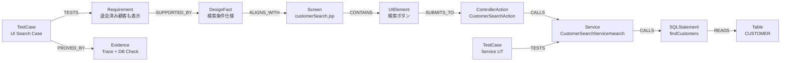

この Path を返すだけでなく、各 Node/Edge の Canonical Record、Snapshot、Source Revision、Evidence に Drill-down できることが要件である。

現行系と Migration 後系を比較する場合は、同じ `Requirement` から `SystemVariant` → `Snapshot` → `Code/DB/Test` の Path を Variant 別に取得し、対応が確認できる対象だけを `MIGRATED_TO` で結ぶ。Variant が異なる Node を同一 Snapshot のように混ぜて影響範囲を確定してはならない。

## 13.6 Projection Flow

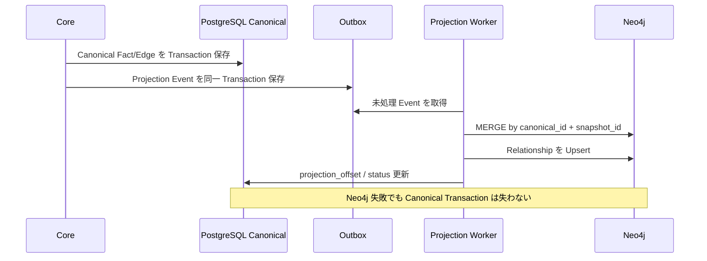

Projection は At-least-once とし、`canonical_id + snapshot_id` により冪等にする。Lag、Failure Count、Last Applied Offset、Schema Version を監視する。

## 13.7 Rebuild と Degraded Mode

### Rebuild

1. 対象 Project/Snapshot の Projection を論理的に新 Namespace へ作る。
2. Node/Edge 件数、孤立 Node、Canonical ID 参照を検証する。
3. Sample Impact Query を PostgreSQL Fact と照合する。
4. Active Projection Pointer を切り替える。
5. 旧 Projection を Retention 後に削除する。

### Degraded Mode

Neo4j が利用できない場合：

- PostgreSQL Canonical Graph の bounded BFS へ Fallback する。
- UI に `graph_projection_unavailable` を表示する。
- Cross-domain Path の Coverage が低下する可能性を明示する。
- 「影響なし」とは判定しない。
- Projection 回復後に Impact Draft を再評価する。

## 13.8 Search/Vector Index

Search Index は候補再現率を上げるために利用し、Impact の正しさを単独で確定しない。

- Keyword Index：Identifier、画面名、テーブル名、業務語彙
- Vector Index：文書領域、Case、説明文の意味類似
- Symbol Index：Qualified Name、Signature、Alias
- Metadata Filter：Project、Snapshot、Revision、Document Type、Confidence

Index が欠落・古い場合は `index_missing` または `index_stale` と表示し、Git/SVN の Source Revision または Canonical Data へ Readback する。

---

# 14. Domain Contract・API 設計（未実装・未公開）

## 14.1 主要 Domain Artifact

表内の Domain Artifact はすべて未定義・未実装・未検証である。

| Artifact | 目的 | 作成者 | 正式化条件 |
|---|---|---|---|
| `RequestStatement` | 顧客原文保存 | Human/Core | 原文 Hash |
| `ChangeCase` | 要求の管理単位 | Core | Schema Valid |
| `AnalysisBaseline` | 解析対象固定 | Core | System Variant、Git/SVN Source Revision と Document Snapshot が Valid |
| `SystemVariantProfile` | 現行／Migration 後の対象系統、VCS、Revision、移行対応関係 | Project Team/Core | `current` / `migrated` の境界・対応付け・Profile Version が承認済み |
| `SourceRevisionRef` | Git/SVN Revision の共通識別 | VersionControlAdapter/Core | Repository Identity + Revision + Tree Digest Valid |
| `SourceChangeSet` | VCS 非依存の変更差分 | VersionControlAdapter/Core | Scope Validation 済み |
| `ContextPackage` | AI 用限定文脈 | Core | Evidence/Revision Valid |
| `ImpactAssessmentDraft` | 影響候補 | AI/Analyst | Schema Valid、未承認 |
| `ApprovedChangeScope` | 変更許可範囲 | Approver/Core | Approval + Digest |
| `CodingTask` | PG/UT 実行単位 | Core | Scope 有効 |
| `BusinessTestCase` | 業務テスト仕様 | AI/Tester | Reviewer Confirmed |
| `TestExecutionAuthorization` | 副作用を持つ実行許可 | Approver/Core | Environment/Data/Expiry Valid |
| `ProjectProfileDraft` / `ApprovedProjectProfile` | 案件固有の System Variant、VCS、Framework、Document、Build、UI、Data、Security 条件 | Project Team/Core | 実環境・実ファイル検証と承認 |
| `DocumentProfile` | 設計書形式の抽出・対応付け規則 | Project Team/Core | Sample Document 検証と承認 |
| `ExcelMacroExecutionProfile` | 現行／Migration 後 Variant ごとの既存 Macro 外部実行条件（内部 VBA は含めない） | Project Team/Core | Variant、Windows Excel、Workbook/Environment/Input/Button/Output が定義済み |
| `ExcelMacroExecution` | PG 前提として実行した Macro の結果 | Macro Worker/Core | Input/Output Hash、Environment、Execution Result |
| `GeneratedCodeImportPlan` | Macro/外部ツールの DTO、JSP、その他生成コードを工程へ導入する候補計画 | Analyst/Developer/Core | Variant、Target、Scope、Hash、Diff、理由が検証済み |
| `GeneratedCodeImportApproval` | 生成コードを工程へ導入する人の許可（Scope 承認・Commit 承認とは別） | 専任 Approver/Core | Plan Digest、Target、Scope、期限、Rollback が別承認済み |
| `GeneratedCodeImportResult` | Staging、適用、拒否、Rollback の結果 | Core/Worker | Source/Target Hash、Diff、Command、結果、Evidence |
| `SourceCommitAuthorization` | Git Commit/Push または SVN Commit の許可 | Approver/Core | ChangeSet Digest、Target、Expiry Valid |
| `ExecutionResult` | Command/Test 結果 | Worker/Core | Output Digest |
| `EvidenceManifest` | 証跡連結 | Core | Required Evidence Complete |
| `DeliveryPackage` | 納品単位 | Core | Review Accepted |

## 14.2 Artifact Envelope

すべての JSON Artifact は共通 Envelope を持つ。

```json
{
  "kind": "ImpactAssessmentDraft",
  "api_version": "scopearc.io/v1",
  "metadata": {
    "artifact_id": "IAD-...",
    "project_id": "PRJ-...",
    "change_case_id": "CC-...",
    "version": 4,
    "created_at": "...",
    "created_by": "...",
    "producer_type": "local_copilot",
    "producer_version": "..."
  },
  "bindings": {
    "snapshot_id": "SNP-...",
    "source_revision_ref": {
      "vcs_type": "git|svn",
      "revision_id": "..."
    },
    "document_profile_version": "...",
    "code_graph_snapshot_id": "CGS-...",
    "context_package_id": "CTX-..."
  },
  "spec": {},
  "integrity": {
    "content_digest": "sha256:...",
    "schema_digest": "sha256:..."
  }
}
```

## 14.3 REST API

VSIX と Server Worker 用の代表 API を示す。実際の Path は OpenAPI で版管理する。API はすべて未実装・未公開・未接続である。

| Method | Path | 用途 | Side Effect |
|---|---|---|---:|
| POST | `/projects/{id}/change-cases` | Case 作成 | Yes |
| GET | `/change-cases/{id}` | Case/State 取得 | No |
| POST | `/change-cases/{id}/baseline` | Snapshot 固定 | Yes |
| POST | `/change-cases/{id}/impact-jobs` | Impact 解析開始 | Yes |
| GET | `/impact-assessments/{id}` | Draft/Graph Path 取得 | No |
| POST | `/impact-assessments/{id}/scope-approvals` | Scope 承認 | Yes/Privileged |
| POST | `/approved-scopes/{id}/coding-tasks` | Coding Task 作成 | Yes |
| POST | `/coding-tasks/{id}/diff-validations` | Git/SVN を正規化した Source ChangeSet 検証 | Yes |
| POST | `/source-change-sets/{id}/commit-authorizations` | Repository 確定操作の承認 | Yes/Privileged |
| POST | `/source-change-sets/{id}/commits` | Git Commit/Push または SVN Commit の実行 | Yes/Authorized |
| POST | `/coding-tasks/{id}/test-runs` | UT 実行 | Yes/Authorized |
| POST | `/test-plans/{id}/ui-runs` | UI 実行 | Yes/Authorized |
| POST | `/coding-tasks/{id}/macro-executions` | 必要な Case の Excel Macro 外部実行 | Yes/Authorized |
| GET | `/macro-executions/{id}` | Macro 実行メタデータ・生成物取得 | No |
| POST | `/macro-executions/{id}/code-import-plans` | 生成コードの候補 Target、Hash、Diff、Scope を登録 | Yes |
| GET | `/code-import-plans/{id}` | 生成コード導入計画を確認 | No |
| POST | `/code-import-plans/{id}/approvals` | 生成コード導入を人が承認 | Yes/Privileged |
| POST | `/code-import-plans/{id}/apply` | Staging/Diff Gate 合格後に工程へ導入 | Yes/Authorized |
| POST | `/code-import-plans/{id}/rollback` | 元 Hash に基づく導入取消 | Yes/Authorized |
| GET | `/executions/{id}/artifacts` | Artifact 一覧 | No |
| POST | `/change-cases/{id}/evidence-manifests` | Manifest 生成 | Yes |
| POST | `/evidence-manifests/{id}/verify` | Digest/Completeness 検証 | Yes |

## 14.4 Command と Query の分離

- Query は状態を変更せず、`as_of_snapshot` と `revision` を指定可能にする。
- Command は `expected_state_version` を要求し、Optimistic Lock を行う。
- 外部副作用を持つ Command は `authorization_id` と `idempotency_key` を要求する。
- 承認 Command は一般 MCP Tool から呼べないよう Role と Channel を制限する。

## 14.5 Event/Outbox

| Event | Consumer |
|---|---|
| `ChangeCaseCreated` | Baseline候補、通知 |
| `BaselineFrozen` | Document/Code Index Worker |
| `CodeGraphSnapshotCompleted` | Neo4j Projection、Impact Worker |
| `ImpactDraftReady` | VSIX Review UI |
| `ChangeScopeApproved` | Coding Task Builder |
| `TaskDiffValidated` | UT Planner |
| `ExcelMacroExecutionCompleted` | PG/UT Planner、Evidence Builder |
| `GeneratedCodeImportPlanCreated` | VSIX Review UI、Scope Gate |
| `GeneratedCodeImportApproved` | Import Worker、Audit |
| `GeneratedCodeImportCompleted` | Diff Gate、UT Planner、Evidence Builder |
| `UnitTestCompleted` | UI Readiness Evaluator |
| `UiExecutionCompleted` | Evidence Builder |
| `EvidenceManifestVerified` | Delivery Builder |
| `ProjectionFailed` | Health/Degraded Mode |

Event は Canonical State そのものではなく通知である。Consumer は Event だけを信頼せず、PostgreSQL から現在 Version を再取得する。

## 14.6 Error Contract

```json
{
  "error_code": "SCOPE_VIOLATION",
  "message_ja": "承認範囲外の変更が検出されました。",
  "retryable": false,
  "change_case_id": "CC-...",
  "details": {
    "unexpected_paths": ["..."],
    "expected_scope_id": "SCP-..."
  },
  "evidence_ref": "EV-...",
  "correlation_id": "COR-..."
}
```

代表 Error Code：

- `REVISION_MISMATCH`
- `SCOPE_APPROVAL_REQUIRED`
- `SCOPE_VIOLATION`
- `COMMAND_NOT_ALLOWED`
- `DATA_POLICY_DENIED`
- `AMBIGUOUS_RECORD_SCOPE`
- `AMBIGUOUS_ACTION_LOCATOR`
- `GRAPH_PROJECTION_STALE`
- `INDEX_MISSING`
- `RUNTIME_EVIDENCE_REQUIRED`
- `EVIDENCE_INCOMPLETE`
- `ARTIFACT_DIGEST_INVALID`

---

# 15. Security・Governance 設計（未実装・未検証）

## 15.1 Trust Boundary

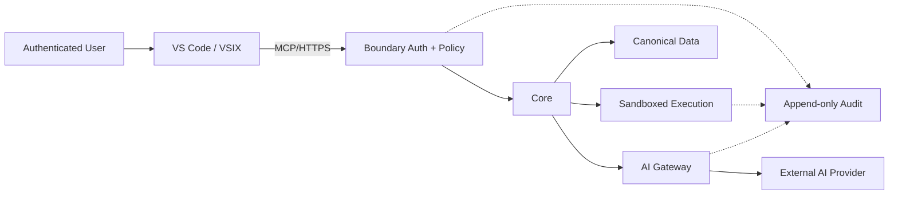

外部 AI Provider、Copilot の生成結果、Project Source、設計書、Test Data を互いに無条件で信頼しない。各境界で Schema、Identity、Revision、Policy、Digest を確認する。

## 15.2 認証・認可

| 対象 | 方針 |
|---|---|
| VSIX → Server | OIDC/OAuth または短命 Access Token |
| MCP Local | Loopback/stdio を優先し、Workspace と User を Binding |
| MCP Remote | HTTPS、OAuth、Tool Scope |
| Worker | Service Identity、mTLS または短命 Credential |
| AI Provider | Server Secret Store。Client/Prompt に露出しない |
| Artifact Store | 署名付き短命 URL または Server Proxy |

Role だけでなく、Project、Environment、Action、Case State、Approval を組み合わせた Policy を使う。

## 15.3 実行安全性

- Command は Allowlist Template から生成する。
- Shell String を自由入力させず、Program と Argument Array を分離する。
- Workdir は Version Control Adapter が作成・検証した隔離 Source Workspace に固定する。
- Environment Variable は Allowlist と Masking を適用する。
- Network Access は Job Type ごとに制御する。
- Production Endpoint、Credential、Database を既定で拒否する。
- Timeout、CPU/Memory、Output Size を制限する。
- Process Tree と Exit Code を記録する。
- 実行後に変更 File と Artifact を再列挙する。
- Excel Macro は専用の管理 Host で実行し、Workbook/Input の原本を Read-only とする。
- Macro の内部を信頼せず、Network、Shell、外部 DLL/COM、Workbook Write は Project Policy と Authorization の許可範囲に限定する。
- Macro の残留 Process、Lock File、未保存変更、生成物以外の変更を検出し、異常時は `blocked` とする。

## 15.4 AI 安全性

- Prompt Injection を含む設計書・Source Comment を「命令」ではなく Data として扱う。
- AI からの Tool Request は Tool Schema と Policy で再検証する。
- AI Response に含まれる File Path、Symbol、SQL を Canonical Store で存在確認する。
- Model/Prompt Version を Artifact に記録する。
- Model の自己申告「テスト済み」「修正済み」を Evidence として採用しない。
- 高リスク操作は Human Confirmation と Execution Authorization の両方を要求する。

## 15.5 Data Classification

| Class | 例 | AI 送信 |
|---|---|---|
| Public | OSS License、公開仕様 | 許可 |
| Internal | 一般設計、匿名化コード | Policy 依存 |
| Confidential | 顧客コード、内部 URL | Local または Sanitized |
| Restricted | Secret、個人情報、本番 Data | 禁止 |

Data Class は Project Profile だけでなく、File/Region/Field 単位の Override を可能にする。

## 15.6 Audit Event

Audit には次を記録する。

- 誰が、いつ、どの Project/Case で操作したか
- どの Client、Plugin/VSIX Version を使用したか
- どの Scope/Authorization/Policy を検査したか
- 実行した Tool/Command と Argument Digest
- 実行結果、変更 Revision、Artifact Digest
- Override、Waiver、差戻し、再実行
- AI Provider、Model、Context Package、Output Digest

Secret や Source 全文は Audit に複製せず、Digest と Access-controlled Artifact Ref を保存する。

---

# 16. 複数プロジェクト再利用・チーム配布（未実装・未配布）

## 16.1 共通化モデル

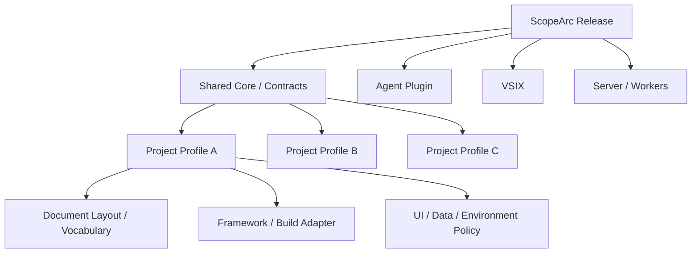

Project ごとに Core や Agent を Fork するのではなく、次を Profile 化する。

| Profile 領域 | 例 |
|---|---|
| System Variant / Lineage | `current`、`migrated`、移行元・移行先の対応、比較方針、同一要求の Variant 別作業 |
| Version Control | Git/SVN、Repository Identity、Project Root、Branch/Path Policy、Externals/Submodule Policy |
| Framework | Struts 1、Spring MVC、Spring Boot MVC（将来）、MyBatis/JPA、独自 Framework |
| Build | Maven/Gradle/Ant、Java Version、UT Command |
| Document | File 命名、Sheet Pattern、Heading、Column Mapping |
| Vocabulary | 日本語業務語、旧名称、新名称、Alias |
| Database | Schema、Migration Tool、Read-only Verification |
| Excel Macro | Windows Excel/Windows Version、Workbook、Button、Input/Output、Trust Policy、PG 使用条件 |
| UI | Base URL、Screen Identity、stable test id、Login Flow |
| Test Data | Seed/API/SQL、Cleanup、Masking |
| Security | Data Class、AI Channel、Allowed Tool、Retention |
| Delivery | 顧客 Template、命名、必要証跡 |

## 16.2 Profile Lifecycle

1. `ProjectProfileDraft` を自動候補化する。
2. 実ファイル、Build、画面、設計書 Sample で検証する。
3. 人が `ApprovedProjectProfile` にする。
4. Case は利用した Profile Version に固定する。
5. Profile 更新は新規 Case に適用し、進行中 Case には自動反映しない。

## 16.3 チーム導入

推奨導入単位：

- 組織内 Marketplace または管理された内部 Release Repository
- 署名済み VSIX
- Agent Plugin Package
- Release Manifest と Checksum
- Schema Compatibility Test
- Project Profile Package

導入時に以下を自動診断する。

- VS Code と GitHub Copilot の必要 Version
- Agent Plugin Preview/Policy の利用可否
- Hooks の許可状態
- MCP Local/Remote の接続状態
- VSIX と Server API の互換性
- Java/Build/Playwright の Toolchain
- Project Profile と Repository/System Variant の一致

## 16.4 Release Channel

| Channel | 用途 | 更新方針 |
|---|---|---|
| `dev` | 開発チーム | 頻繁、互換性検証前を含む |
| `pilot` | 選定案件 | Migration/Runtime 証跡付き |
| `stable` | 全チーム | 承認済み、Rollback 確認済み |
| `lts` | 長期案件 | Security/重大 Bug のみ |

Profile と Core の Compatibility を Release Gate で検査する。

## 16.5 配布物の責任分界

| Owner | 管理対象 |
|---|---|
| Product Team | Core、Contracts、Agent Plugin、VSIX、Server |
| Platform Team | Deployment、Identity、Secret、Monitoring |
| Project Team | Project Profile、Vocabulary、Test Data Rule |
| Security | AI Channel Policy、Data Class、Retention |
| QA | Case Template、Evidence Requirement、Acceptance |

---

# 17. Deployment・運用アーキテクチャ（未配備・未運用）

## 17.1 初期 Deployment

状態：未配備・未起動・未監視・未検証。以下は新規構築する配置候補であり、稼働中の環境ではない。

初期は単一組織内で次の構成を推奨する。

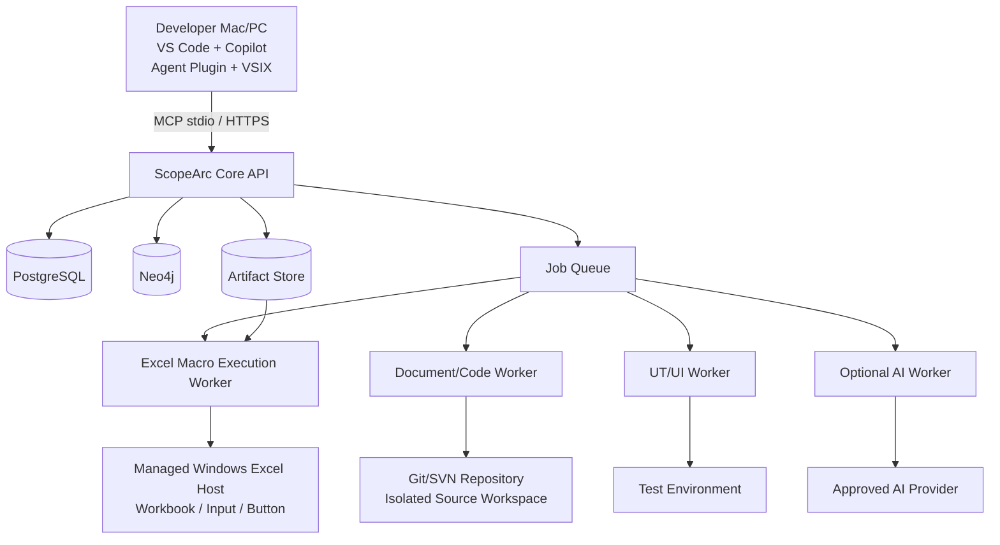

Local-only PoC では Core、PostgreSQL、Neo4j を開発端末または内部 Server に配置できる。ただし ID、Schema、Projection、Evidence 契約は本番構成と同一に保つ。

## 17.2 Environment

| Environment | 目的 | 制約 |
|---|---|---|
| local | Profile 作成、解析開発 | Synthetic Data、外部送信既定拒否 |
| integration | Core/Worker/DB 統合 | Test Repository |
| project-test | 実案件検証 | Masked Data、Project Policy |
| staging | 納品前 E2E | Production 相当、書込承認 |
| production-control | 正式 Case/Audit 管理 | Source 実行と Data 操作を最小化 |
| excel-runner | Macro が必要な PG 用の外部実行 | 管理された Windows Excel/OS、原本 Read-only、Network/Shell Policy |

## 17.3 Observability

### Metrics

- Case lead time：Intake → Scope → PG → Evidence
- Impact Candidate 数と Confirmed/Rejected/Unresolved 比率
- Anchor Resolution Rate
- Graph Projection Lag/Failure
- Search Index Freshness
- Scope Violation 数
- UT/UI Passed/Failed/Blocked/Flaky
- Evidence Completeness
- AI Job Latency/Cost/Error/Schema Failure
- Project Profile Drift

### Trace

`correlation_id`、`change_case_id`、`execution_id` を VSIX、API、Worker、Test、Evidence で共通利用する。

### Health State

| Component | State |
|---|---|
| PostgreSQL | required：停止時は書込み Flow 停止 |
| Version Control（Git/SVN） | required for analysis/coding |
| Artifact Store | required for Evidence Completion |
| Neo4j | degraded fallback 可能 |
| Search Index | degraded fallback 可能 |
| Server AI | optional：Local Copilot へ切替可能 |
| Copilot | interactive AI unavailable：決定論的機能は利用可能 |
| Excel Macro Host | conditional：Macro 不要 Case は未使用。実行失敗時は PG/UT を `blocked` |

## 17.4 Backup・Recovery

- PostgreSQL：Point-in-time Recovery、定期 Restore Test
- Artifact Store：Versioning、Retention、Digest Validation
- Neo4j：Backup 依存ではなく Canonical から Rebuild 可能にする
- Search Index：Snapshot または完全 Reindex
- VCS Source Cache：Git Remote/Commit または SVN Repository UUID/Revision/Path と Source Tree Digest を照合
- Release Package：署名、Checksum、LTS 保管

---

# 18. 実装ロードマップ（全 Phase 未着手）

## 18.1 基本方針

本版では別製品・旧プロジェクトのコード、Contract、MCP Tool、Code Graph、Playwright、PostgreSQL 基盤を移行資産として扱わない。ScopeArc は新規実装として、要件、Contract、実装、検証、配布を順番に構築する。全 Phase は未着手である。

## 18.2 Phase

全 Phase の状態：未着手・未完了。Deliverable は作成前、Exit Criteria は未実施である。

### Phase 0：Architecture Baseline

目的：ScopeArc の製品境界と新規実装範囲を確定する。完了状態ではない。

Deliverable：

- Architecture Decision Records
- Artifact/State Catalog
- 未実装・未検証項目一覧
- Plugin/VSIX/Server Responsibility Matrix
- Security/Data Policy Draft

Exit Criteria（未達）：README、Architecture、Contract が同じ製品境界を示すこと。

### Phase 1：Plugin-first Intake と Baseline

目的：VS Code から Case 作成、Snapshot 固定、Document/Code 状態確認を行う。

Deliverable：

- Change Case Explorer
- Intake Agent/Skill
- Project Profile
- Git/SVN Source Revision と Document Baseline
- 新規 MCP Tool Contract の設計

Exit Criteria（未達）：Web UI を使用せず Case から Context Package まで作れること。

### Phase 2：Evidence-bound Impact Analysis

目的：Anchor-first 影響分析と承認を新規構築する。完了状態ではない。

Deliverable：

- Document/Code Difference States
- Context Package Inspector
- Impact Draft/Unknown Report
- Approved Change Scope
- Neo4j Projection と Cross-domain Path

Exit Criteria：実案件 Sample で Requirement → Code/DB/Test の根拠 Path を表示し、Unknown を明示できる。

### Phase 3：PG・UT Gate

目的：Copilot の実装を Approved Scope 内に制限する仕組みを新規構築する。完了状態ではない。

Deliverable：

- Coding Task
- VersionControlAdapter と Isolated Source Workspace Manager
- Pre/Post Hooks
- Diff Gate
- Windows Excel Macro Runner（PG の条件付き工程）
- DTO/JSP/その他 Generated Code Import Plan、別承認、Target Hash/Diff、Rollback
- UT Selection/Execution/Evidence

Exit Criteria：Scope 外変更が確実に拒否され、承認範囲内の UT Result が Case に結び付く。

### Phase 4：UI Automation と Evidence Delivery

目的：業務 Case から UI 実行、証跡、納品までを閉じる。

Deliverable：

- Business Test Case Editor
- Data Binding
- Fail-closed Locator Runtime
- Trace/Screenshot/DB Evidence
- Evidence Manifest/Delivery Package

Exit Criteria：要求 → UI Result → Evidence を同じ Case/Revision で検証できる。

### Phase 5：Server AI と Batch Scale

目的：同一契約で Provider-neutral Server AI を導入する。

Deliverable：

- AI Gateway/Router
- Data Classification/Redaction
- Job Queue/Checkpoint
- Provider Adapter
- Cost/Usage/Audit

Exit Criteria：Local Copilot と Server AI の Candidate Artifact が同じ Review/Gate を通る。

### Phase 6：Team Release と Multi-project Expansion

目的：複数案件への統制された展開。

Deliverable：

- Agent Plugin/VSIX Paired Release
- Internal Marketplace/Distribution
- Compatibility Test
- Project Onboarding Kit
- LTS/Upgrade/Rollback Procedure

Exit Criteria：二つ以上の異なる Java Web 案件で Core を Fork せず利用できる。

## 18.3 優先順位

| Priority | 内容 | 理由 |
|---|---|---|
| P0 | Case/Baseline/Scope/Evidence Contract | 後工程すべての基準 |
| P0 | Plugin-first 製品境界 | Web/VSIX の二重投資を防ぐ |
| P0 | Revision/Scope Gate | AI 変更の安全性 |
| P0 | Git/SVN Version Control Adapter | 対象工程の VCS 差異を Core から分離する |
| P1 | Legacy Java Anchor/Graph | 影響分析の中核 |
| P1 | Document Difference State | 不完全設計書への対応 |
| P1 | PG/UT Evidence | 実装結果の再現性 |
| P1 | UI fail-closed | 誤 Record 操作を防ぐ |
| P2 | Neo4j Projection | Cross-domain 探索の高速化 |
| P2 | Server AI | Batch/Scale。Local で先行可能 |
| P2 | Multi-project Marketplace | Core 安定後に展開 |

---

# 19. Verification・受入基準（全項目未実施）

## 19.1 Architecture Acceptance

- [ ] VS Code だけで主要業務 Flow を完結できる。
- [ ] Agent Plugin と VSIX の責務が重複せず、同一 Version で配布される。
- [ ] Server/Core は UI に依存せず、Local Copilot と Server AI の両 Channel を扱える。
- [ ] PostgreSQL が Canonical、Neo4j/Search が Derived であることを Schema と運用で証明できる。
- [ ] Neo4j を空にして Canonical Data から Rebuild できる。
- [ ] AI 不可時も Case、Baseline、Scope、Evidence を操作できる。

## 19.2 Impact Acceptance

- [ ] 顧客原文が改変されず保存される。
- [ ] Case が検証済み Git/SVN Source Revision と Document Snapshot に固定される。
- [ ] 影響項目ごとに Anchor、Graph Path、Document Region、Runtime Evidence のいずれかがある。
- [ ] 設計書とコードの差異状態を表示できる。
- [ ] `unresolved` を「影響なし」に変換しない。
- [ ] AI が提示した File/Symbol を Version Control Adapter の Source Readback で検証する。
- [ ] Draft と Approved Scope が別 Artifact である。

## 19.3 PG/UT Acceptance

- [ ] Approved Scope なしでは Source 編集用 Task を発行しない。
- [ ] Scope 外 File/Symbol の変更を Diff Gate が検出する。
- [ ] 実行 Command は Allowlist と Authorization を通る。
- [ ] Base Revision、Working Revision、Diff Digest が記録される。
- [ ] Git と SVN の双方で同じ Scope Gate と Evidence Contract が機能する。
- [ ] SVN の Mixed Revision、Switched Path、Property、Externals を検出できる。
- [ ] Git Commit/Push または SVN Commit は有効な `SourceCommitAuthorization` なしでは実行されない。
- [ ] UT Command、Exit、Log、JUnit、Coverage State が Case に結び付く。
- [ ] `blocked/partial/not_run` が Passed と区別される。

## 19.4 UI Acceptance

- [ ] Screen Identity、Record Scope、Action Locator の三段階 Gate がある。
- [ ] 曖昧 Locator を fail-closed で拒否する。
- [ ] Test Data の作成、変更、Cleanup が追跡される。
- [ ] UI 実行 Revision と Deployment Revision が一致する。
- [ ] Trace、Screenshot、Console、Network が Execution ID に結び付く。
- [ ] Failure を Product/Test/Data/Environment/Coverage に分類できる。

## 19.5 Excel Macro Execution Acceptance

- [ ] Excel Macro は CodeGraph、Impact Candidate、Code Anchor の解析対象外である。
- [ ] Macro/VBA を読み取らず、Workbook、Excel Environment、Configured Button、Input/Output だけを Profile として管理する。
- [ ] Input File は `existing/external/generated` の Source Type、Path/参照先、Business Key、Hash を持ち、原本を変更しない。
- [ ] Input 候補が 0 件または複数件で一意に選べない場合、自動実行せず `blocked` になる。
- [ ] Workbook と Windows Excel/Windows OS/Trust Policy を実行前に確認し、Configured Button を一意に確認してから操作する。
- [ ] Output File の Hash、Size、更新時刻、業務 Key/Schema と Execution ID が Evidence に記録される。
- [ ] Output Type が `dto/jsp/java/xml/sql/config` の場合、`GeneratedCodeImportPlan` が作成され、Target Path、Source/Target Hash、Diff、Scope、導入理由を保持する。
- [ ] 生成コードは Scope 承認者・Commit 承認者とは別の人による `GeneratedCodeImportApproval` と Staging/Diff Gate なしには工程へ導入されない。
- [ ] Target Hash 不一致、Scope 外 Path、既存変更との衝突、検証失敗は自動上書きせず `blocked` になる。
- [ ] 導入後の VCS Status、生成元 Macro Execution、Import Result、Rollback 情報が Evidence に結び付く。
- [ ] 正式に取り込んだ DTO/JSP/その他ファイルが `SourceChangeSet`、`SourceCommitAuthorization`、Commit 後の `SourceRevisionRef` に結び付く。
- [ ] Macro 実行失敗または出力検証不能時、PG の後続工程（生成コード導入、Diff Gate、UT）を成功扱いで継続しない。
- [ ] Macro の VBA 修正・Web 化・Java 化は別 Change Case と承認なしには実行されない。

## 19.6 Evidence Acceptance

- [ ] Manifest が要求、Baseline、Scope、Diff、UT、UI を連結する。
- [ ] Artifact Digest を再検証できる。
- [ ] 必須 Evidence 不足時は Completion を拒否する。
- [ ] 未確認・未実施項目が Delivery Report に表示される。
- [ ] Reviewer が Source/Design/Runtime Evidence へ Drill-down できる。

## 19.7 Multi-project Acceptance

- [ ] 異なる Build/Framework/Document Layout を Profile で切り替えられる。
- [ ] Core の案件別 Fork を必要としない。
- [ ] Agent Plugin、VSIX、Server、Schema の Compatibility を自動検証する。
- [ ] Team Installation、Upgrade、Rollback 手順が再現できる。

---

# 20. Test Strategy（全テスト未実施）

## 20.1 Test Pyramid

| Layer | 対象 |
|---|---|
| Schema/Contract Test | Artifact、MCP Tool、REST、Event の互換性 |
| Domain Unit Test | State Transition、Scope、Policy、Coverage |
| Adapter Test | Struts/Spring/JSP/SQL/Document Extractor |
| Repository Test | PostgreSQL Canonical、Outbox、Idempotency |
| Projection Test | PostgreSQL → Neo4j の完全性と再構築 |
| Retrieval Eval | Recall、Suppression、Re-rank、Context Selection |
| VCS Adapter Test | Git Commit/Worktree と SVN Revision/Working Copy/Property/Externals の正規化 |
| Integration Test | VSIX/MCP/Core/Worker/Git/SVN/Artifact |
| UI E2E | VS Code Flow と対象 Java Web 業務 Case |
| Excel Macro Execution Verification | コード変更中に必要な既存 Workbook、Configured Button、Input/Output Hash、Excel Environment |
| Generated Code Import Test | Target Hash 衝突、Scope 外 Path、Staging、Diff、Approval、Rollback |
| Security Test | Tool Injection、Scope Bypass、Secret、Data Exfiltration |
| Recovery Test | DB Restore、Projection Rebuild、Index Rebuild、Job Resume |

## 20.2 Golden/Silver Dataset

実案件の匿名化 Sample を使い、次を持つ評価 Dataset を作る。

- 顧客文
- 正解または Reviewer 合意済み Impact Target
- Known Unknown/Runtime Requirement
- Code/Design Mapping
- Required UT/UI Case
- Expected Graph Path
- False Positive/False Negative の理由

AI Model 単体ではなく、Deterministic Retrieval + Graph + AI + Review を一つの Pipeline として評価する。

## 20.3 Quality Gate

Pilot で少なくとも次を測定する。

- Critical Impact の見落とし率
- Evidence のない Candidate 比率
- Unknown の適切な保持率
- Scope 外変更検出率
- UT/UI 再現率
- Evidence Manifest 完全率
- Reviewer の修正量と所要時間

数値目標は実案件 Baseline 測定後に確定する。根拠なしに最初から「100% 自動化」「100% 影響検出」を KPI にしない。

---

# 21. リスク・対策・未決事項

## 21.1 主なリスク

| ID | リスク | 対策 |
|---|---|---|
| R-01 | 設計書形式が案件ごとに大きく異なる | Document Profile Draft/Approval、原本 Region 参照 |
| R-02 | Legacy 動的挙動を解析できない | Runtime Enrichment、Unknown、Coverage Gap |
| R-03 | RAG Candidate が多すぎる | Filter/Suppression/Merge/Re-rank の可視化 |
| R-04 | AI が存在しない Symbol を生成 | VCS Source Readback、Schema、Anchor Validation |
| R-05 | Scope が広すぎて承認が形骸化 | File/Symbol/DB/Test 単位、Risk-based 分割 |
| R-06 | Hook 無効化で Guard が失われる | Core 側で同一 Policy を強制 |
| R-07 | Agent Plugin が Preview/Client 依存 | VSIX/Core を権威境界にし、Compatibility Check |
| R-08 | Neo4j と PostgreSQL が不一致 | Transactional Outbox、Offset、Rebuild、Lag 表示 |
| R-09 | UI Test が誤 Data を更新 | Screen/Record/Action 三段階 fail-closed |
| R-10 | Evidence が巨大化 | Artifact Store、Retention、Digest、Tiering |
| R-11 | Server AI に機密送信 | Project Policy、Redaction、Local-only Default |
| R-12 | 複数案件で Profile が分岐 | Versioned Profile、Compatibility Test、Owner 明確化 |
| R-13 | 製品境界を誤って Web-first として新規実装し二重構造になる | Phase 0 で Plugin-first の製品境界と責任分界を固定する |
| R-14 | 自動化を急ぎ Reviewer が追えない | Inspector、Graph Path、Evidence Drill-down を優先 |
| R-15 | SVN の Mixed Revision、Switched Path、Property/Externals を見落とす | Baseline Gate と SourceStatusSnapshot で fail-closed にする |
| R-16 | Excel Macro の内部を推測して影響範囲へ混入する、または既存 Input を誤って上書きする | Macro を解析対象外の外部依存として隔離し、事前設定 Button、Input Hash、Read-only 原本、Output Verification、失敗時 `blocked` を強制する |

## 21.2 未決事項

以下は利用者・顧客・運用環境の情報を得た後に確定する。

1. 最初に Pilot する実プロジェクトと代表 Change Case
2. 対象 Java/JDK、Build Tool、Framework Version
3. 設計書の実ファイル形式、件数、サイズ、保管場所
4. 現行／Migration 後の各対象工程の VCS 種別（Git/SVN）、Repository Identity、Branch または Repository Path、Review/Commit 規則、両者の移行対応関係
5. Test/Staging 環境への Deployment 方法
6. Test Data 作成・初期化・Cleanup の権限
7. 顧客向け成果物 Template と必須承認欄
8. GitHub Copilot Business/Enterprise の組織 Policy
9. Agent Plugin、Hooks、Remote MCP の組織内利用可否
10. Server AI Provider 候補、Data Residency、契約上の送信制約
11. Artifact Retention と Audit Retention 期間
12. Neo4j の運用形態（Self-hosted/Managed）
13. PostgreSQL/Artifact Store の既存基盤利用可否
14. 本番相当 UI Test で許される副作用
15. Windows Excel 実行 Host、Excel/Windows Version、COM/Desktop Automation、Macro Trust Policy、既存 Input File の保管場所と選択権限
16. 電力システム固有の業務語彙、データ分類、業務カレンダー、権限、承認、監査、障害対応ルール

未決事項があっても、Contract と State を先に設計することで Local Copilot-only の Pilot は開始可能である。ただし実データ送信や本番相当操作は、該当 Policy が確定するまで禁止する。

## 21.3 再審査結果（すべて未完了）

本版を、既存実装・旧プロジェクト・外部成果物に依存しない新規設計として再審査した。完了と判定できる項目はない。

| ID | 再審査項目 | 状態 | 完了に必要なもの |
|---|---|---|---|
| RR-001 | ScopeArc の実装 Repository、対象 Java Web Repository、代表 Revision | 未完了・未受領 | Pilot Project、VCS、Revision、実コード |
| RR-002 | 顧客設計書とコードの実データ検証 | 未完了・未受領 | 設計書原本、Document Profile、抽出結果、差異レビュー |
| RR-003 | Agent Plugin、VSIX、Agents、Skills、Instructions、Prompts | 未作成・未検証 | Package、Manifest、Install、Version、Team Policy |
| RR-004 | Hooks、MCP、Core Boundary | 未作成・未検証 | Tool/Hook Schema、Authorization、Bypass Test、実行証跡 |
| RR-005 | PostgreSQL Canonical、Neo4j Projection、Artifact Store | 未構築・未検証 | Migration、Projection、Rebuild、Backup/Restore、運用環境 |
| RR-006 | Excel Macro 外部実行 | 未実装・未検証 | Workbook、Host、Input、Button、Output、Trust Policy |
| RR-007 | Macro 生成コードの工程導入 | 未設計完了・未実装 | Import Plan、Approval、Target Hash、Staging、Diff、Rollback、VCS 反映 |
| RR-008 | PG、UT、UI 自動テスト | 未実装・未実行 | Build、Data、Environment、Command、Trace、Result、Coverage |
| RR-009 | Evidence、成果物、Delivery | 未生成・未検証 | Manifest、Digest、Template、Review、Retention |
| RR-010 | Server AI API | 未接続・未検証 | Provider、Data Policy、Gateway、Cost、Audit、契約承認 |
| RR-011 | 受入基準と Traceability | 未実施 | FR/NFR → Artifact → API → Test → Evidence の対応表 |
| RR-012 | チーム配布と多案件再利用 | 未配布・未検証 | Compatibility、署名、内部配布、Upgrade、Rollback |
| RR-013 | 現行／Migration 後システムの Variant・Lineage | 未設計完了・未検証 | Variant 別 Repository/Revision/Profile、移行対応、両方の作業計画 |
| RR-014 | 電力システム業務プロファイル | 未定義・未検証 | 業務語彙、データ分類、業務カレンダー、権限、承認、監査、障害ルール |

`RR-001`～`RR-014` はすべて未完了であり、次版で個別の証跡が提示された場合のみ状態を更新する。

---

# 22. 初期 Product Backlog（全 Story 未完了）

| Epic | Story | 完了定義 | 状態 |
|---|---|---|---|
| E1 Product Boundary | Web-first 記述を Plugin-first に更新 | README/ADR/Architecture 一致 | 未完了 |
| E2 Artifact Contract | Case/Baseline/Impact/Scope/Evidence Schema | Contract Test 合格 | 未完了 |
| E3 VSIX Intake | Case Tree と Intake Editor | Web なしで Case 作成 | 未完了 |
| E4 Project Profile | Git/SVN、Repository/Document/Build Profile | Sample Project で Approved | 未完了 |
| E5 Code Anchor | Java/JSP/XML/SQL Anchor | Revision 再解決可能 | 未完了 |
| E6 Impact Pipeline | Retrieval Trace と Draft | Evidence/Unknown 表示 | 未完了 |
| E7 Neo4j Projection | Canonical → Projection | Rebuild/Lag Test 合格 | 未完了 |
| E8 Scope Approval | Diff Editor と Approval Grant | Scope Digest 固定 | 未完了 |
| E9 Copilot Package | 3 Agents、6 Skills、Instructions、Prompts | Team Install 可能 | 未完了 |
| E10 Hooks/MCP | Pre/Post Guard と bounded tools | Bypass Test 合格 | 未完了 |
| E11 PG/UT | Git Worktree/SVN Working Copy、Diff Gate、UT Result | 両 VCS で Scope 外変更拒否 | 未完了 |
| E12 UI Test | Case/Data/Locator/Trace | Fail-closed E2E 合格 | 未完了 |
| E13 Excel Macro Execution | Opaque Macro、Input Binding、Configured Button、Output Verification、Generated Code Import | Macro を解析せず PG 用の再現実行、必要なコード導入、Evidence を取得 | 未完了 |
| E14 Evidence | Manifest/Report/Hash | Completion Gate 合格 | 未完了 |
| E15 Server AI | Gateway/Policy/Job | Local と同じ Artifact | 未完了 |
| E16 Release | Plugin+VSIX+Server Compatibility | Pilot Upgrade/Rollback 合格 | 未完了 |

---

# 23. Architecture Decision Records（全 ADR 未承認・未実装）

以下の ADR は設計候補を記録したものであり、顧客・Project Team・Security・運用担当による正式承認、実装、検証はすべて未完了である。

## ADR-001：VS Code Plugin-first

**Decision**：利用者向け主要 UI は VS Code とし、新規独立 Web UI は構築しない。

**Reason**：主要利用者はコード、Version Control、Copilot、Test を VS Code 内で扱う。別 Web UI は Context Switching と二重実装を増やす。

**Consequence**：VSIX の品質、VS Code Version Compatibility、Remote Server 接続設計が重要になる。

## ADR-002：Agent Plugin と VSIX を併用

**Decision**：Agents/Skills/Hooks/MCP/Prompts は Agent Plugin、製品 UI と VS Code API 連携は VSIX に置く。

**Reason**：再利用可能な Copilot カスタマイズと VS Code 固有実装の Lifecycle を分離しつつ、同じ Release で統制できる。

## ADR-003：PostgreSQL Canonical、Neo4j Projection

**Decision**：Workflow、Fact、Approval、Evidence Metadata は PostgreSQL を正本とし、Neo4j は関係探索用に Projection する。

**Reason**：Transaction、監査、版管理を一つの正本で保ち、Graph の探索性能を利用できる。

## ADR-004：Draft と Approved Scope の分離

**Decision**：AI 影響分析を `ImpactAssessmentDraft`、人の変更許可を `ApprovedChangeScope` とする。

**Reason**：AI 候補と変更権限を混同しないため。

## ADR-005：Anchor-first、RAG-second

**Decision**：Document/Code Anchor と Graph を先に作り、RAG/AI はその候補説明と補助に使う。

**Reason**：不完全な設計書と Legacy 動的コードに対して、根拠のない Semantic Similarity を確定関係にしないため。

## ADR-006：Local Copilot と Server AI の二 Channel

**Decision**：二つの AI 実行経路は同一 Job、Context、Artifact、Evidence Contract を使う。

**Reason**：顧客 Policy、規模、Cost、可用性に応じて Channel を交換可能にするため。

## ADR-007：UI Automation は fail-closed

**Decision**：Screen、Record、Action の一意性が確認できない場合は UI 操作を実行しない。

**Reason**：曖昧な Locator による誤更新は、テスト失敗より重大であるため。

## ADR-008：対象工程の Git/SVN を Adapter で統一

**Decision**：顧客 Java Web 工程の Version Control は Git と SVN の双方を対象とし、Domain Core は `SourceRevisionRef`、`SourceWorkspaceRef`、`SourceChangeSet` だけを使用する。

**Reason**：Git の Commit/Worktree と SVN の Repository Revision/Working Copy は意味が異なる。VCS 固有概念を Case、Scope、Evidence に直接埋め込むと、案件ごとに Workflow が分岐するため。

**Consequence**：SVN の Mixed Revision、Switched Path、Property Change、Externals と、Git の Dirty/Untracked/Submodule を Adapter Test と Baseline Gate で扱う必要がある。

## ADR-009：Excel Macro は不透明な外部実行依存とする

**Decision**：既存 Excel Macro は CodeGraph、Impact Analysis、Code Anchor の解析対象にせず、PG で必要な場合だけ `ExcelMacroExecutionProfile` に従う外部実行 Step として利用する。

**Reason**：Macro は以前のシステムに依存する既存ツールであり、今回の Java Web コード変更の解析対象ではない。VBA の推測や自動解析を混ぜると、存在しない影響関係を作り、原本や業務操作を壊す危険があるため。

**Consequence**：Workbook、Windows Excel/OS Environment、入力ファイル、事前設定 Button、生成ファイル、Execution Evidence だけを管理する。Macro 失敗、入力の曖昧さ、出力検証不能は `blocked`/`coverage_gap` とし、VBA 修正や Web 化は別 Change Case と承認で行う。

---

# 24. 参照情報

## 24.1 本版の設計根拠

本版の設計根拠は、利用者から提示された業務要求、対象工程の想定（電力システム、日本向け Java Web、現行／Migration 後システム、Git/SVN、複数の設計書、Windows Excel Macro、ローカル GitHub Copilot、将来の Server AI、正式 VCS Commit）および本書内で定義した未完了の目標契約だけである。

ScopeArc の実装 Repository、対象 Java Web Repository、設計書原本、Macro Workbook、実 DB、実行環境は未受領であり、実装・稼働・性能・受入の証拠は存在しない。

## 24.2 公式技術資料

- [Visual Studio Code: Agent Plugins](https://code.visualstudio.com/docs/agent-customization/agent-plugins)
- [Visual Studio Code: Custom Agents](https://code.visualstudio.com/docs/agent-customization/custom-agents)
- [Visual Studio Code: Customize AI](https://code.visualstudio.com/docs/agent-customization/overview)
- [Visual Studio Code: Hooks](https://code.visualstudio.com/docs/agent-customization/hooks)
- [Visual Studio Code Extension API: MCP](https://code.visualstudio.com/api/extension-guides/ai/mcp)
- [Visual Studio Code Extension API: AI Extensibility](https://code.visualstudio.com/api/extension-guides/ai/ai-extensibility-overview)
- [Visual Studio Code Extension API: Language Model](https://code.visualstudio.com/api/extension-guides/ai/language-model)
- [Playwright: Locators](https://playwright.dev/docs/locators)
- [Playwright: Best Practices](https://playwright.dev/docs/best-practices)
- [Neo4j Operations Manual](https://neo4j.com/docs/operations-manual/current/introduction/)
- [Git: git-worktree Documentation](https://git-scm.com/docs/git-worktree.html)
- [Apache Subversion: Quick Start](https://subversion.apache.org/quick-start)
- [Apache Subversion FAQ: Mixed-revision Working Copies](https://subversion.apache.org/faq.en.html)

---

# 25. 用語集

| 用語 | 定義 |
|---|---|
| Canonical Data | 正式な状態・Fact・契約を保持する正本データ |
| Projection | Canonical Data から用途別 Store へ再構成した派生データ |
| Change Case | 一つの顧客要求・問題・障害を追跡する業務単位 |
| Baseline | 解析対象を固定した Git/SVN Source Revision、Document、Environment の組合せ |
| VersionControlAdapter | Git と SVN の固有操作を共通 Source Contract に変換する Adapter |
| SourceRevisionRef | VCS Type、Repository Identity、Project Path、不変 Revision、Tree Digest の組合せ |
| SourceWorkspaceRef | PG/UT 用に Base Revision から分離した Git Worktree または SVN Working Copy |
| SourceChangeSet | Git/SVN の追加・変更・削除・Rename・Property Change を正規化した差分 |
| SourceCommitAuthorization | Review 済み ChangeSet を Git/SVN Repository に確定するための期限付き許可 |
| Code Anchor | Revision 上の File/Symbol/Range/Digest を持つコード参照 |
| Context Package | AI に渡す根拠付き・範囲限定・版管理された文脈 |
| ImpactAssessmentDraft | AI/Analyst が作成する未承認の影響候補 |
| ApprovedChangeScope | 人が承認した変更可能範囲とテスト義務 |
| Evidence | 主張を裏付ける Source、Document、Runtime、Test、Artifact |
| Evidence Manifest | Artifact の ID、関係、Hash、Coverage を束ねる一覧 |
| ExcelMacroExecutionProfile | Macro 内部を解析せず、Workbook、Environment、Input、Configured Button、Output を定義する実行条件 |
| Source Hash | Macro が生成した DTO/JSP/その他ファイルの内容を識別する指紋 |
| Target Hash | 生成物を導入する先に現在存在するファイルの内容を識別する指紋。適用直前に変わっていれば自動上書きしない |
| GeneratedCodeImportPlan | 生成コードをどの Target Path に導入するかを Hash、Diff、Scope 付きで表す未承認計画 |
| GeneratedCodeImportApproval | GeneratedCodeImportPlan の導入を人が許可する期限付き承認 |
| GeneratedCodeImportResult | 生成コードの Staging、適用、拒否、Rollback の結果と証跡 |
| Runtime Required | 静的解析では確定できず実行観測が必要な状態 |
| Coverage Gap | 必要な対象を現在の Test/Evidence で確認できない状態 |
| fail-closed | 安全条件を確認できない場合に処理を拒否する方針 |
| MCP | Copilot/Agent と Core の Tool/Resource/Prompt 境界 |
| Agent Plugin | Copilot カスタマイズ資産をまとめて配布する Package |
| VSIX | VS Code Extension の配布形式 |
| PG | 本文書では Programming／コーディング |
| UT | Unit Test |

---

# 26. 次回具体化で必要な入力

本基本設計から実装設計へ進む際、最初の Pilot Project について次を収集する。

1. 現行／Migration 後の System Variant ごとの VCS 種別（Git/SVN）、Repository URL/Root、Repository Identity、対象 Branch または SVN Path、代表 Source Revision、および移行対応関係
2. Java/JDK、Application Server、Framework、Build Tool
3. 代表的な設計書 5〜10 ファイル
4. 顧客要求の実例 3〜5 件
5. 既知の設計書とコードの不一致例
6. Test Environment の起動・Login・Data 準備方法
7. 既存 UT/UI Test と CI Command
8. 顧客向け成果物 Template
9. チーム Role と承認者
10. GitHub Copilot の組織 Policy
11. 外部 AI API 利用可否と Data Class
12. PostgreSQL、Neo4j、Artifact Store の配置制約
13. Windows Excel の Version、Windows Version、Workbook、Button、Trust Policy、生成する DTO/JSP/その他コードとデータの実例、拡張子、生成元 Input、候補 Target Path
14. 生成コード導入の専任承認者、Target Hash 衝突時の扱い、Rollback 方針、Git/SVN 反映規則
15. 電力システムの業務用語、データ分類、業務カレンダー、権限、承認、監査、障害対応ルール

これらをもとに、次版では Logical Schema、OpenAPI/MCP Tool Schema、VSIX 画面遷移、Project Profile、Pilot Test Case、Sprint Backlog を具体化する。

---

---

## 文書終了
