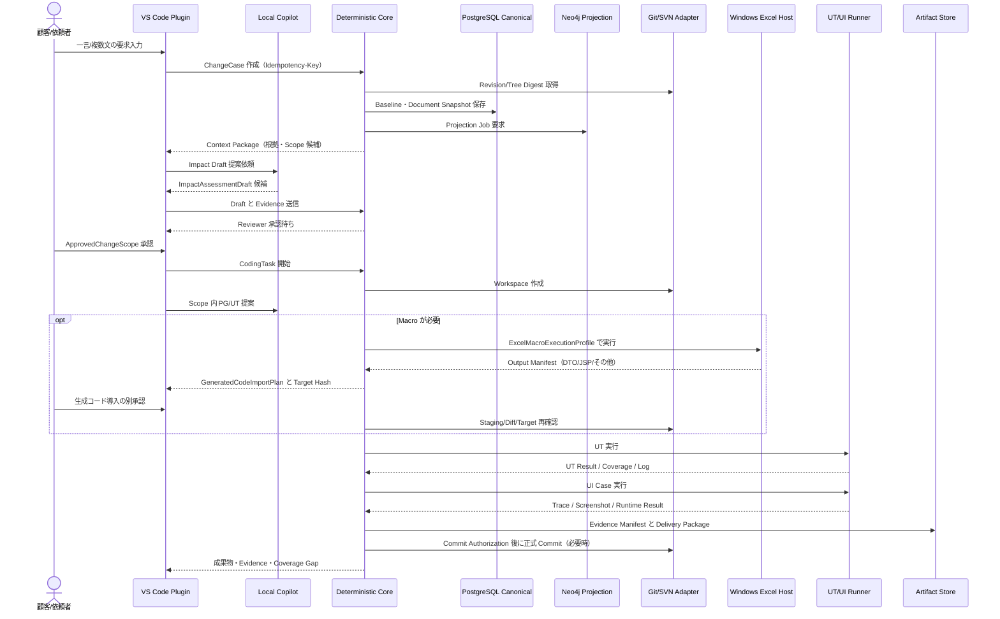

# ScopeArc

## AI駆動変更デリバリー・証跡基盤

### 詳細設計補足書（Draft v0.4）

| 項目 | 内容 |
|---|---|
| 文書名 | ScopeArc AI駆動変更デリバリー証跡基盤 詳細設計補足書 |
| 基本設計 | `ScopeArc_AI駆動変更デリバリー証跡基盤_要件定義_基本設計_技術アーキテクチャ_ja.md` |
| 対象 | 日本向け Java Web（Struts 1、Spring MVC、将来 Framework 拡張） |
| 業務ドメイン | 電力システム（業務ルール、データ分類、承認規則は未確認） |
| 対象 Variant | 現行システム、Migration 後システム。混在させない |
| VCS | Git または SVN（Adapter で共通化） |
| AI | VS Code 上のローカル GitHub Copilot を主経路、Server AI API は将来候補 |
| Macro | Windows Excel。Macro は PG の条件付き工程、VBA 内部は解析対象外 |
| 文書版 | Draft v0.4（全項目未完了・未検証） |
| 状態 | 実装、DB 適用、Runtime、UT、UI、Evidence はすべて未完了・未検証 |

本書は基本設計を実装設計へ落とすための独立した補足書である。対象 Repository、設計書原本、Macro Workbook、実 DB、Windows Excel、テスト環境は未受領であるため、Schema、API、状態、配置、検証値はすべて設計候補とする。実装時には実案件の Project Profile と Pilot 結果を優先し、不明点は `unresolved`、`unknown`、`runtime_required`、`coverage_gap` として保存する。

---

# 1. 詳細設計の境界

| レイヤ | 本書で固定するもの | 本書で固定しないもの | 状態 |
|---|---|---|---|
| VS Code Plugin | Command、Tree View、Diff、承認操作、状態表示、Context Package 受け渡し | 顧客別 UI 文言、組織 Policy の最終値 | 未完了・未検証 |
| Agents / Skills / Hooks | 役割、入力 Schema、禁止事項、出力 Artifact、失敗処理 | Copilot UI での最終提供可否 | 未完了・未検証 |
| Deterministic Core | 状態遷移、Scope 検査、Hash、VCS、Test、Evidence 統制 | AI モデル、性能値 | 未完了・未検証 |
| PostgreSQL | Canonical Entity、FK、Unique、Optimistic Lock、Audit | 本番サイズ、HA 構成 | 未完了・未検証 |
| Neo4j | Projection Node/Relationship、Impact Query、再構築、Degraded | 業務正本としての更新 | 未完了・未検証 |
| Worker | Windows Excel、UT、UI Runner の入出力契約 | Windows Image、Excel/Browser Version | 未完了・未検証 |
| VCS Adapter | Git/SVN の Revision、Diff、Apply、Commit 契約 | 対象 URL、認証、Branch/Path | 未完了・未検証 |

# 2. Change Case 状態機械

一つの顧客要求を `Change Case` とする。同じ要求から現行／Migration 後の双方を扱う場合も、Variant、Baseline、Coding Task、Evidence は個別に保持する。

| 状態 | 入る条件 | 許可操作 | 出る条件 | 失敗・停止状態 | 状態 |
|---|---|---|---|---|---|
| `INTAKE` | 顧客文、依頼者、Project、Variant 候補を受領 | Case 補足、重複候補確認 | 必須入力と Variant を候補化 | `BLOCKED_INCOMPLETE_INTAKE` | 未完了・未検証 |
| `BASELINE_LOCKED` | Source Revision、設計書 Snapshot、Environment を固定 | Read、再取得、Hash 確認 | Baseline Digest 確定 | `BLOCKED_BASELINE_CHANGED` | 未完了・未検証 |
| `ANALYSIS_DRAFTED` | Deterministic Fact と AI 候補が保存済み | 根拠追加、候補抑制、質問作成 | Impact と Gap がレビュー可能 | `BLOCKED_NO_EVIDENCE` | 未完了・未検証 |
| `WAITING_SCOPE_APPROVAL` | Draft を Reviewer に提示 | 差戻し、候補修正、承認申請 | Scope 承認 | `REJECTED_SCOPE` | 未完了・未検証 |
| `SCOPE_APPROVED` | Scope が有効、期限内、Version 一致 | Scope 内 Coding Task 作成 | PG 開始条件成立 | `BLOCKED_SCOPE_EXPIRED` | 未完了・未検証 |
| `CODING` | Workspace と Coding Task を固定 | Scope 内編集、Diff、UT 準備 | SourceChangeSet 候補生成 | `BLOCKED_SCOPE_VIOLATION` | 未完了・未検証 |
| `MACRO_EXECUTING` | Macro、Windows Host、Profile が許可 | Workbook 操作、Output 回収 | Output Manifest 検証可能 | `BLOCKED_MACRO_INPUT` / `BLOCKED_MACRO_OUTPUT` | 未完了・未検証 |
| `WAITING_GENERATED_IMPORT_APPROVAL` | Import Plan が作成済み | Diff 表示、Target Hash 再取得 | 専任 Approver が承認 | `BLOCKED_TARGET_HASH_CONFLICT` / `REJECTED_GENERATED_IMPORT` | 未完了・未検証 |
| `IMPORT_APPLIED` | Import Approval、Hash、Scope が一致 | Staging 適用、Rollback | SourceChangeSet へ取り込み | `BLOCKED_APPLY_FAILED` | 未完了・未検証 |
| `UT_EXECUTED` | Compile、UT、Test Data 条件を満たす | 結果再取得、失敗分類 | UT Result と Coverage 保存 | `BLOCKED_UT_ENVIRONMENT` / `UT_FAILED` | 未完了・未検証 |
| `UI_EXECUTED` | UI Case、Record Scope、Locator、Data を固定 | UI、Trace、Screenshot | UI Result と Evidence 保存 | `BLOCKED_LOCATOR` / `UI_FAILED` | 未完了・未検証 |
| `EVIDENCE_ASSEMBLED` | Source、Design、Runtime、Test Evidence が Binding 済み | Manifest 再計算、Gap 追加 | Delivery Package 候補生成 | `BLOCKED_EVIDENCE_GAP` | 未完了・未検証 |
| `READY_TO_DELIVER` | Reviewer が Manifest を確認 | Export、顧客提出 | Package 保存 | `REJECTED_DELIVERY` | 未完了・未検証 |
| `CANCELLED` | 依頼者が明示取消 | Read、監査確認 | 終端 | なし | 未完了・未検証 |

## 2.1 不変条件

1. `ApprovedChangeScope` なしの Source 変更 Command は拒否する。
2. Target Hash が取得できない、または適用直前に変化している場合、自動上書きせず `BLOCKED_TARGET_HASH_CONFLICT` とする。
3. UI 合否は Screenshot だけで確定しない。画面同一性、Record、Locator、Trace、期待結果、Runtime Log を結合する。
4. `READY_TO_DELIVER` は VCS Commit 済みを意味しない。Commit は `SourceCommitAuthorization` と別 Evidence で扱う。
5. 状態変更は Actor、Policy Version、Correlation ID、Evidence Digest 付きの `AuditEvent` として追記する。

## 2.2 基本シーケンス



# 3. PostgreSQL Logical Schema

PostgreSQL は Canonical の正本である。Neo4j、検索 Index、Embedding、Cache、集計 View は再構築可能な派生物とする。`canonical_id` は不変外部参照 ID、`row_version` は楽観ロック、`created_at`/`updated_at` は監査時刻である。

| Entity / Table | 主キー | 主要カラム | FK / Unique | 代表状態 | 状態 |
|---|---|---|---|---|---|
| `project` | `project_id` | `project_key`, `name`, `profile_version`, `data_class` | `project_key` unique | `draft`, `active`, `suspended` | 未完了・未検証 |
| `system_variant` | `variant_id` | `project_id`, `variant_key`, `kind`, `lineage_ref` | `(project_id, variant_key)` unique | `current`, `migrated`, `unknown` | 未完了・未検証 |
| `source_revision` | `revision_id` | `variant_id`, `vcs_type`, `repository_identity`, `revision`, `tree_digest` | `(variant_id, vcs_type, revision)` unique | `locked`, `unavailable` | 未完了・未検証 |
| `document_snapshot` | `document_id` | `variant_id`, `path`, `format`, `content_digest`, `profile_version` | `(variant_id, path, content_digest)` unique | `indexed`, `parse_gap` | 未完了・未検証 |
| `change_case` | `case_id` | `project_id`, `variant_id`, `request_text`, `request_digest`, `state`, `correlation_id` | `correlation_id` unique | 状態機械の全状態 | 未完了・未検証 |
| `impact_assessment_draft` | `draft_id` | `case_id`, `baseline_id`, `candidate_json`, `evidence_ids`, `confidence`, `state` | `case_id` + `draft_version` | `draft`, `submitted`, `rejected` | 未完了・未検証 |
| `approved_change_scope` | `scope_id` | `case_id`, `draft_id`, `path_rules`, `symbol_rules`, `test_obligations`, `approver`, `expires_at` | `scope_version` unique | `pending`, `approved`, `expired`, `revoked` | 未完了・未検証 |
| `coding_task` | `coding_task_id` | `scope_id`, `workspace_ref`, `agent_id`, `source_revision_id` | `scope_id` + `task_key` | `ready`, `running`, `blocked`, `done` | 未完了・未検証 |
| `macro_execution` | `macro_run_id` | `coding_task_id`, `profile_id`, `host_digest`, `input_manifest`, `output_manifest`, `result` | `coding_task_id` + `run_no` | `queued`, `running`, `succeeded`, `blocked` | 未完了・未検証 |
| `generated_file` | `generated_file_id` | `macro_run_id`, `source_path`, `content_digest`, `file_type`, `source_kind` | `macro_run_id` + `source_path` | `staged`, `rejected`, `imported` | 未完了・未検証 |
| `generated_code_import_plan` | `import_plan_id` | `case_id`, `scope_id`, `generated_file_id`, `target_path`, `source_hash`, `target_hash`, `diff_digest` | `case_id` + `target_path` + `plan_version` | `draft`, `approved`, `blocked`, `applied` | 未完了・未検証 |
| `source_change_set` | `change_set_id` | `coding_task_id`, `vcs_type`, `base_revision`, `files`, `diff_digest` | `coding_task_id` + `change_set_version` | `candidate`, `reviewed`, `committed` | 未完了・未検証 |
| `test_case` | `test_case_id` | `case_id`, `test_type`, `precondition`, `steps`, `expected`, `data_ref` | `case_id` + `stable_key` | `draft`, `approved`, `disabled` | 未完了・未検証 |
| `test_execution` | `execution_id` | `test_case_id`, `environment_digest`, `started_at`, `result`, `trace_ref` | `execution_id` unique | `queued`, `passed`, `failed`, `blocked` | 未完了・未検証 |
| `evidence` | `evidence_id` | `case_id`, `kind`, `artifact_uri`, `content_digest`, `binding_json` | `content_digest` + `artifact_uri` | `collected`, `invalid`, `accepted` | 未完了・未検証 |
| `audit_event` | `event_id` | `case_id`, `actor`, `action`, `from_state`, `to_state`, `policy_version`, `payload_digest` | `case_id` + `sequence_no` | append-only | 未完了・未検証 |

## 3.1 冪等性、楽観ロック、再実行

- 変更系 API は `If-Match: row_version` または `expected_version` を要求し、不一致は `409 VERSION_CONFLICT` とする。
- Worker 再送は `Idempotency-Key` と `operation_fingerprint` が一致した場合だけ同じ結果を再利用する。入力が異なる同一 Key は拒否する。
- Audit、Artifact、VCS 操作は削除せず、無効化・差戻し・Rollback を新しい Event として追加する。
- Macro、UT、UI の再実行は同じ Run を上書きせず、Run No と Environment Digest を更新して保存する。

# 4. REST / MCP Contract

REST は VSIX、将来 Server AI、Batch Worker の境界、MCP は Copilot が呼び出す bounded Tool/Resource の境界とする。Core Canonical を直接更新できる主体は VSIX と認可済み Worker に限定する。

| Operation | Method / Tool | 入力 | 正常出力 | Side Effect / Gate | 状態 |
|---|---|---|---|---|---|
| Case 作成 | `POST /v1/change-cases` / `case.create` | request_text、project、variant、requester | `ChangeCaseEnvelope` | Idempotency-Key 再送は同一 Case | 未実装・未検証 |
| Baseline 固定 | `POST /v1/cases/{caseId}/baselines:lock` / `baseline.lock` | VCS ref、Document refs、Environment | `BaselineEnvelope` | Revision と Digest を再取得 | 未実装・未検証 |
| Context 取得 | `GET /v1/cases/{caseId}/context-packages/{id}` / `context.get` | package_id、purpose | `ContextPackage` | Evidence、Code Anchor、Filter を含む | 未実装・未検証 |
| Impact Draft 保存 | `POST /v1/cases/{caseId}/impact-drafts` / `impact.save` | candidate、evidence、gap | `ImpactAssessmentDraft` | Scope 承認前は候補編集のみ | 未実装・未検証 |
| Scope 承認 | `POST /v1/cases/{caseId}/scope-approvals` / `scope.approve` | scope_id、decision、comment | `ApprovedChangeScope` | Approver、期限、Policy Version を保存 | 未実装・未検証 |
| Coding Task 作成 | `POST /v1/cases/{caseId}/coding-tasks` / `coding.start` | scope_id、workspace、agent | `CodingTask` | Scope と Baseline Version を再検証 | 未実装・未検証 |
| Macro 実行 | `POST /v1/coding-tasks/{id}/macro-runs` / `macro.execute` | profile_id、input_manifest、button_ref | `MacroExecution` | Windows Host と Read-only を確認 | 未実装・未検証 |
| Import Plan 作成 | `POST /v1/cases/{caseId}/generated-import-plans` / `import.plan` | generated_file、target、source_hash、target_hash | `GeneratedCodeImportPlan` | Target 一意性と Scope を検証 | 未実装・未検証 |
| 生成コード導入承認 | `POST /v1/import-plans/{id}/approvals` / `import.approve` | decision、comment、expected_version | `GeneratedCodeImportApproval` | Scope 承認とは別 Approver | 未実装・未検証 |
| Diff Gate | `POST /v1/import-plans/{id}:validate` / `import.validate` | current_target_hash、diff_digest | `GeneratedCodeImportResult` | Hash 不一致は `blocked` | 未実装・未検証 |
| UT 実行 | `POST /v1/coding-tasks/{id}/ut-runs` / `ut.execute` | command_ref、test_selection、env_ref | `UTResult` | 未許可 Command、環境不足は拒否 | 未実装・未検証 |
| UI 実行 | `POST /v1/cases/{caseId}/ui-runs` / `ui.execute` | test_case、record_scope、locator、data_ref | `UIExecutionResult` | Screen/Record/Action の一意性を検査 | 未実装・未検証 |
| Evidence 取得 | `GET /v1/cases/{caseId}/evidence-manifest` / `evidence.get` | case_id、coverage_view | `EvidenceManifest` | Coverage Gap を隠さない | 未実装・未検証 |
| Delivery Export | `POST /v1/cases/{caseId}/delivery-packages` / `delivery.export` | manifest_id、template、include_vcs | `DeliveryPackage` | Reviewer と Binding を再確認 | 未実装・未検証 |

## 4.1 共通 Envelope

```json
{
  "schema_version": "scopearc.contract.v0.4",
  "request_id": "req-opaque",
  "correlation_id": "case-opaque",
  "project_id": "project-opaque",
  "variant_id": "variant-opaque",
  "baseline_id": "baseline-opaque",
  "actor": { "type": "human|copilot|core|worker", "id": "actor-opaque" },
  "data": {},
  "evidence_refs": [],
  "warnings": [],
  "state": "design_only",
  "row_version": 1
}
```

Error は `code`、`category`、`retryable`、`blocking_reason`、`required_action`、`evidence_refs` を持つ。`BLOCKED_TARGET_HASH_CONFLICT`、`BLOCKED_SCOPE_VIOLATION`、`BLOCKED_NO_EVIDENCE`、`VERSION_CONFLICT` は曖昧な再試行を許可しない。

# 5. Neo4j Projection

Neo4j は Canonical の代替ではなく、影響経路と Cross-domain Query のための Projection である。Node/Relationship は `canonical_id`、`project_id`、`variant_id`、`baseline_id`、`source_revision_id`、`projection_version` を持つ。

| Node | 必須属性 | Relationship | 更新元 | 状態 |
|---|---|---|---|---|
| `Project` | `canonical_id`, `project_key` | `HAS_VARIANT` | `project` | 未構築・未検証 |
| `SystemVariant` | `canonical_id`, `variant_key`, `kind`, `lineage_ref` | `HAS_REVISION` | `system_variant` | 未構築・未検証 |
| `SourceRevision` | `canonical_id`, `vcs_type`, `revision`, `tree_digest` | `CONTAINS_FILE` | `source_revision` | 未構築・未検証 |
| `CodeFile` | `canonical_id`, `path`, `content_digest` | `DECLARES_SYMBOL` | Code Anchor Index | 未構築・未検証 |
| `CodeSymbol` | `canonical_id`, `kind`, `name`, `range_digest` | `CALLS`, `READS`, `WRITES` | Static Parser | 未構築・未検証 |
| `DesignFact` | `canonical_id`, `document_id`, `fact_type`, `value_digest` | `SPECIFIES` | Document Parser | 未構築・未検証 |
| `ImpactItem` | `canonical_id`, `status`, `confidence`, `evidence_ids` | `AFFECTS`, `SUPPORTED_BY` | Impact Draft | 未構築・未検証 |
| `TestCase` | `canonical_id`, `stable_key`, `test_type` | `VERIFIES` | Test Case | 未構築・未検証 |
| `Evidence` | `canonical_id`, `kind`, `digest`, `artifact_uri` | `BINDS` | Evidence | 未構築・未検証 |

## 5.1 影響経路 Query 例

```cypher
MATCH (c:ChangeCase {canonical_id: $caseId})
MATCH p=(c)-[:TARGETS_VARIANT|BASED_ON|HAS_IMPACT|AFFECTS|SUPPORTED_BY|VERIFIED_BY*1..8]->(n)
WHERE all(x IN nodes(p) WHERE x.project_id = $projectId AND x.variant_id = $variantId)
RETURN p,
       [x IN nodes(p) | {id:x.canonical_id, label:labels(x), status:x.status}] AS nodes,
       [r IN relationships(p) | type(r)] AS relationships
LIMIT $maxPaths
```

Projection 欠落、Version 不一致、Digest 不一致は「影響なし」と解釈せず、`projection_missing` または `coverage_gap` として Core に返す。Neo4j 停止時は Canonical 操作を継続できるが、Impact の確定と Evidence の受入は停止する。

# 6. Copilot 資産パッケージ

複数 Project で再利用する業務固定資産を Source Repository で版管理し、Agent Plugin と VSIX を同じ Release ID で配布する。実際の入口の対応可否は組織環境で PoC し、未対応の入口は無理に採用しない。

```text
scopearc-ai-assets/
├── .github/
│   ├── copilot-instructions.md
│   ├── agents/
│   │   ├── change-impact-analyst.agent.md
│   │   ├── implementation-ut-engineer.agent.md
│   │   └── ui-evidence-verifier.agent.md
│   └── prompts/
│       ├── start-impact.prompt.md
│       ├── review-scope.prompt.md
│       └── assemble-evidence.prompt.md
├── skills/
│   ├── document-profile/
│   ├── code-anchor-impact/
│   ├── pg-ut-gate/
│   ├── macro-generated-import/
│   ├── ui-evidence/
│   └── delivery-package/
├── hooks/
│   ├── pre-tool-scope-check.json
│   └── post-run-evidence-capture.json
├── mcp/
│   ├── server-manifest.json
│   └── tools.schema.json
├── plugin.json
├── release-manifest.json
└── CHANGELOG.md
```

| 資産 | 入力 | 禁止事項 | 出力 | 状態 |
|---|---|---|---|---|
| `change-impact-analyst` | Case、Baseline、Context Package | Source 編集、Scope 承認、Commit | ImpactAssessmentDraft、質問、Evidence refs | 未作成・未検証 |
| `implementation-ut-engineer` | ApprovedChangeScope、CodingTask、Workspace | Scope 外編集、未許可 Command、直接 Commit | SourceChangeSet、UT Result | 未作成・未検証 |
| `ui-evidence-verifier` | UI Case、Record Scope、Test Data | `.first`、曖昧 locator、Screenshot 単独判定 | UI Result、Trace、Screenshot、Coverage | 未作成・未検証 |
| `document-profile` Skill | Document Profile、原本 URI、Parser Version | 推測による補完、原本改変 | DesignFact、Parse Gap、Document Evidence | 未作成・未検証 |
| `macro-generated-import` Skill | Output Manifest、Import Plan、Target Hash | VBA 推測、Target 自動上書き | Diff、Import Result、Conflict Evidence | 未作成・未検証 |
| `pre-tool-scope-check` Hook | Tool、Path、Command、Scope | Scope 不明、未許可環境操作 | Allow / Deny と理由 | 未作成・未検証 |
| `post-run-evidence-capture` Hook | Run ID、stdout/stderr、Artifact | ログ欠落、未 Binding Screenshot | Evidence Draft、Digest、Audit | 未作成・未検証 |
| `scopearc-core` MCP | Contract Version、Actor、Case/Scope | 直接 DB 操作、Core 認可迂回 | Schema 検証済み Artifact | 未実装・未接続 |

# 7. Excel Macro・生成コード導入

Macro は Java Web コードの解析機能ではなく、PG の条件付き工程である。Windows Excel で既存 Workbook を開き、入力を設定し、既存 Button を押して DTO、JSP、Java、XML、SQL、Config、Data、Other を生成する。Macro 内部 VBA は解析対象外とする。

## 7.1 ExcelMacroExecutionProfile

| 項目 | 例 | 検証方法 | 失敗時 | 状態 |
|---|---|---|---|---|
| `host_os` | Windows | Host attestation | `BLOCKED_MACRO_HOST` | 未完了・未検証 |
| `excel_version` | 未定 | Version 取得 | `BLOCKED_MACRO_VERSION` | 未完了・未検証 |
| `workbook_uri` | 管理された原本 URI | URI、Digest、Read-only | `BLOCKED_MACRO_WORKBOOK` | 未完了・未検証 |
| `input_manifest` | existing / external / generated | 候補件数、Digest、Schema | `BLOCKED_MACRO_INPUT` | 未完了・未検証 |
| `button_ref` | Sheet、Caption、Shape/Control ID | 一意性、事前登録値 | `BLOCKED_MACRO_BUTTON` | 未完了・未検証 |
| `output_root` | Worker Staging | Sandbox、Path Policy | `BLOCKED_MACRO_OUTPUT` | 未完了・未検証 |
| `output_manifest` | DTO/JSP/その他の一覧 | Path、Type、Digest、Size | `coverage_gap` | 未完了・未検証 |
| `runtime_evidence` | Excel Log、Host、操作時刻 | Artifact Digest | Evidence invalid | 未完了・未検証 |

## 7.2 生成コード導入ゲート

1. `GeneratedFile` ごとに `source_hash`、`source_path`、`file_type`、`source_kind`、生成時刻、Macro Run を保存する。
2. `GeneratedCodeImportPlan` は `target_path`、対象 Variant、Base Revision、`target_hash_at_plan`、Scope Rule、Diff Digest、Rollback 方法を必須とする。
3. 導入直前に Target を再読込し、`target_hash_current` と `target_hash_at_plan` を比較する。
4. 不一致、Target 不存在、複数候補、Scope 外 Path、Diff Parse 不能は `blocked`。自動上書き、推測 Merge、`.first` 相当の候補選択は禁止する。
5. 専任 Approver の `GeneratedCodeImportApproval` 後にだけ Staging へ適用する。Scope 承認、Commit 承認とは別承認である。
6. 適用後は format、compile、UT、SourceChangeSet、Evidence を作成し、正式 VCS 反映は `SourceCommitAuthorization` 後に行う。

# 8. UT・UI 自動テスト・Evidence

| Test Type | 実行前固定 | 最低限の結果 | Evidence | 合否を確定できない条件 | 状態 |
|---|---|---|---|---|---|
| UT | SourceChangeSet、Build Profile、Test Selection、DB/Fixture | exit code、test list、failure、coverage | stdout/stderr、JUnit、Coverage、Environment Digest | Build/Dependency/Fixture 不明 | 未実施・未検証 |
| UI | Case、Screen Identity、Record Scope、Action Locator、Test Data | Step Result、期待値、Trace、Runtime Log | Screenshot、Trace、Console、Network、Data Snapshot | Screenshot のみ、Record 一意性なし | 未実施・未検証 |
| Macro acceptance | Workbook Digest、Host、Input/Output Manifest、Button | Output の型・Path・Digest・件数 | Excel Log、操作時刻、生成ファイル | VBA 成功だけで Output 不明 | 未実施・未検証 |
| Evidence assembly | Case、Baseline、Revision、Run、Artifact | Manifest、Binding、Coverage Gap | Manifest JSON、Digest、Reviewer | Binding 欠落、Digest 再計算不能 | 未実施・未検証 |

UI Locator は次の順で解決する。

1. URL/Route、タイトル、主要コンテナ、アプリ Version で画面を識別する。
2. 業務 Record Scope（ID、キー、行、顧客番号など）を一意に絞る。
3. Record 内で Role、Label、Test ID、安定属性から Action Locator を一意に解決する。
4. 0 件、複数件、動的で再確認不能の場合は操作せず `BLOCKED_LOCATOR` とする。
5. 期待結果、DOM/Runtime、Trace、Screenshot、Log を同じ `test_execution_id` に Binding する。

# 9. Git / SVN Adapter

Agent に VCS 固有コマンドを直接公開せず、Core が `VersionControlAdapter` を通して操作する。Project Profile で Git または SVN を選び、Variant ごとの Adapter、Revision、Path を固定する。

| 共通操作 | Git 実装候補 | SVN 実装候補 | 許可条件 | 状態 |
|---|---|---|---|---|
| `read_revision` | commit SHA、tree digest | revision number、working-copy digest | Baseline Lock 中は Read-only | 未実装・未検証 |
| `create_workspace` | worktree / detached checkout | isolated working copy | Revision、Path、Workspace Scope | 未実装・未検証 |
| `status` | porcelain status | `svn status` | 結果を保存 | 未実装・未検証 |
| `diff` | unified diff、rename、mode | unified diff、property change | ChangeSet 正規化 | 未実装・未検証 |
| `apply_change_set` | patch / file write | patch / file write | Scope、Target Hash、Approval | 未実装・未検証 |
| `commit` | commit with message | commit with message | SourceCommitAuthorization のみ | 未実装・未検証 |
| `rollback` | revert / new revert commit | revert / reverse merge | 人手承認、Evidence 保存 | 未実装・未検証 |

Formal Commit metadata は `case_id`、`variant_id`、`baseline_id`、`scope_id`、`change_set_id`、`test_execution_ids`、`evidence_manifest_id`、Actor、Authorization を含める。Commit 不可の場合も `VCS_COMMIT_BLOCKED` と理由、未反映 ChangeSet、次の手動操作を保存する。

# 10. Delivery Package と Evidence Manifest

```text
delivery-package-{case_id}/
├── manifest.json
├── request/change-case.json
├── baseline/source-revision.json
├── baseline/document-snapshot.json
├── baseline/environment.json
├── impact/impact-assessment-draft.json
├── impact/approved-change-scope.json
├── impact/questions-and-gaps.md
├── source/source-change-set.diff
├── source/generated-code-import-plan.json
├── source/target-hash-conflicts.json
├── test/ut-result.xml
├── test/ui-result.json
├── test/trace.zip
├── test/coverage.json
├── evidence/screenshots/
├── evidence/logs/
├── evidence/evidence-bindings.json
└── review/approvals.json
```

`manifest.json` は `schema_version`、`package_id`、`case_id`、Project/Variant、Baseline、Source Revision、Artifact List、Digest Algorithm、Coverage、Unresolved、Reviewer、生成時刻を必須とする。Artifact URI が存在しても Digest、Binding、Revision が一致しなければ正式 Evidence としない。

# 11. 配置・運用単位

| 配置単位 | 初期案 | 責務 | 依存 | 状態 |
|---|---|---|---|---|
| VSIX | Developer PC | UI、Copilot Context、承認、Diff、Status | Core API、MCP、SecretStorage | 未配備・未検証 |
| Core API | Team Local Server または管理環境 | Canonical、Policy、VCS、Evidence、Outbox | PostgreSQL、Artifact Store | 未配備・未検証 |
| PostgreSQL | 管理 DB | Canonical、Audit、Outbox | Backup、Role、Migration | 未構築・未検証 |
| Neo4j | 管理 DB または分離 Service | Projection、Impact Query | Projection Worker | 未構築・未検証 |
| Artifact Store | 管理 File/Object Store | Screenshot、Log、Diff、Package | Digest、Retention | 未構築・未検証 |
| Windows Excel Worker | 管理 Windows Desktop/VM | Macro、Output 回収 | Excel、Trust Policy、Profile | 未配備・未検証 |
| UT/UI Runner | CI または隔離 Worker | Compile、UT、Browser、Trace | Environment、Test Data | 未配備・未検証 |
| Server AI Gateway | 将来候補 | Provider、Model Policy、Audit | 外部 AI API、Data Policy | 未接続・未検証 |

初期 Pilot は VSIX、Core、PostgreSQL、Artifact Store、既存 Git/SVN、Windows Excel Host の最小構成から開始する。Neo4j、Server AI、Batch Scale は Canonical と Evidence Chain が確認された後に追加する候補である。

# 12. 詳細設計レビュー・次の実装設計物

| Review ID | 確認内容 | 必要証拠 | 合格条件（将来） | 現在の状態 |
|---|---|---|---|---|
| DD-001 | 状態遷移と Scope 外操作 | API/Command Log、Audit Event | Scope 外書込みが拒否される | 未実施 |
| DD-002 | PostgreSQL と Neo4j の結び付き | Cross-domain Query、Projection Run | Canonical ID/Revision/Variant が一致 | 未実施 |
| DD-003 | Git/SVN 共通契約 | Git/SVN Read/Diff/Commit Test | Revision、Diff、Commit Evidence が再現 | 未実施 |
| DD-004 | Macro Output 導入安全性 | Workbook/Host/Input/Output Manifest | Target Hash 不一致で自動上書きされない | 未実施 |
| DD-005 | UI Locator fail-closed | Screen/Record/Action 失敗 Case | 0 件・複数件・曖昧 locator が停止 | 未実施 |
| DD-006 | Evidence Manifest 再現性 | Package、Digest、Binding、Reviewer | Artifact と Source/Run/Environment を再計算 | 未実施 |
| DD-007 | Copilot 資産の配布再現性 | Plugin/VSIX、Release Manifest、Install Log | 複数 Project に同一 Version を導入 | 未実施 |
| DD-008 | 電力ドメイン妥当性 | 用語、業務ルール、代表 Case | 顧客 Reviewer が用語・承認・障害分類を確認 | 未実施 |

次に作成する実装設計物は、`ProjectProfile` 等の JSON Schema、PostgreSQL migration、OpenAPI/MCP Schema、VSIX Wireframe、Git/SVN Contract Test、Windows Excel Host Test、代表要求の Golden/Silver Case、Plugin/Agents/Skills/Hooks/MCP の Release Manifest である。これらが作成されるまで、本書は正式な開発仕様書、顧客提出物、実行保証ではない。

---

## 文書終了
